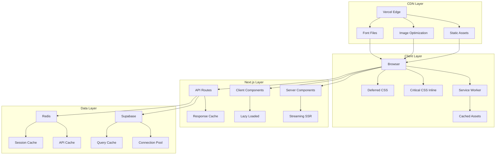

# Design Document

## Overview

This design document outlines the technical approach for comprehensive performance optimization of the Next.js 15 e-commerce application. The optimization strategy focuses on reducing bundle sizes, improving rendering performance, optimizing database queries, and ensuring excellent Core Web Vitals scores across all devices and browsers.

The design builds upon existing optimizations (lazy loading, bundle splitting, Firefox compatibility) and introduces new strategies for CSS delivery, component architecture, font loading, and monitoring.

## Architecture

### High-Level Architecture



### Performance Optimization Layers

1. **Build-Time Optimizations**: CSS purging, tree-shaking, code splitting
2. **Server-Side Optimizations**: Server Components, streaming, caching
3. **Client-Side Optimizations**: Lazy loading, prefetching, service worker
4. **Network Optimizations**: CDN, compression, HTTP/2, resource hints
5. **Database Optimizations**: Indexes, connection pooling, query optimization

## Components and Interfaces

### 1. CSS Optimization System

#### Critical CSS Extractor
```typescript
interface CriticalCSSConfig {
  pages: string[];
  dimensions: { width: number; height: number }[];
  penthouse: {
    timeout: number;
    maxEmbeddedBase64Length: number;
  };
}

class CriticalCSSExtractor {
  async extractCritical(url: string): Promise<string>;
  async inlineInHTML(html: string, css: string): Promise<string>;
  async generateForAllPages(): Promise<Map<string, string>>;
}
```

#### CSS Module System
```typescript
// Convert global CSS to CSS Modules
// Before: globals.css with all styles
// After: Component-specific CSS modules

// Example: ProductCard.module.css
.card {
  @apply rounded-lg shadow-md;
}

.image {
  @apply w-full h-auto;
}
```

### 2. Component Architecture Refactoring

#### Server/Client Component Strategy
```typescript
// Pattern 1: Push client boundary down
// Before:
"use client";
export function ProductPage() {
  return (
    <div>
      <ProductInfo /> {/* All client */}
      <AddToCartButton /> {/* Needs client */}
    </div>
  );
}

// After:
export function ProductPage() { // Server Component
  return (
    <div>
      <ProductInfo /> {/* Server Component */}
      <AddToCartButton /> {/* Client Component */}
    </div>
  );
}
```

#### Lazy Loading Strategy
```typescript
interface LazyComponentConfig {
  component: () => Promise<any>;
  loading?: React.ComponentType;
  ssr?: boolean;
  suspense?: boolean;
}

const LazyProductGallery = dynamic(
  () => import('./ProductGallery'),
  {
    loading: () => <Skeleton />,
    ssr: false,
  }
);
```

### 3. Font Optimization System

#### Font Loading Strategy
```typescript
interface FontConfig {
  family: string;
  weights: number[];
  subsets: string[];
  display: 'swap' | 'optional' | 'fallback';
  preload: boolean;
}

class FontOptimizer {
  async subsetFont(fontPath: string, characters: string): Promise<Buffer>;
  async generateFontFace(config: FontConfig): Promise<string>;
  async preloadFonts(fonts: FontConfig[]): Promise<string>;
}
```

#### Font Loading Implementation
```typescript
// next/font/local for self-hosted fonts
import localFont from 'next/font/local';

const inter = localFont({
  src: [
    {
      path: './fonts/inter-latin-400.woff2',
      weight: '400',
      style: 'normal',
    },
    {
      path: './fonts/inter-latin-700.woff2',
      weight: '700',
      style: 'normal',
    },
  ],
  variable: '--font-inter',
  display: 'swap',
  preload: true,
  fallback: ['system-ui', 'arial'],
});
```

### 4. Database Optimization Layer

#### Query Optimization
```typescript
interface QueryOptimizer {
  // Add indexes
  createIndexes(): Promise<void>;
  
  // Optimize N+1 queries
  batchLoad<T>(ids: string[]): Promise<T[]>;
  
  // Connection pooling
  getConnection(): Promise<PoolClient>;
  releaseConnection(client: PoolClient): void;
}

// Example: Optimize product queries
async function getProductsWithImages(categoryId: string) {
  // Before: N+1 query
  const products = await db.products.findMany({ where: { categoryId } });
  for (const product of products) {
    product.images = await db.images.findMany({ where: { productId: product.id } });
  }
  
  // After: Single JOIN query
  const products = await db.products.findMany({
    where: { categoryId },
    include: { images: true },
  });
  
  return products;
}
```

#### Caching Strategy
```typescript
interface CacheStrategy {
  key: string;
  ttl: number;
  staleWhileRevalidate?: number;
  tags?: string[];
}

class APICache {
  async get<T>(key: string): Promise<T | null>;
  async set<T>(key: string, value: T, ttl: number): Promise<void>;
  async invalidate(tags: string[]): Promise<void>;
  async wrap<T>(key: string, fn: () => Promise<T>, ttl: number): Promise<T>;
}

// Usage
const products = await cache.wrap(
  `products:${categoryId}`,
  () => getProductsWithImages(categoryId),
  3600 // 1 hour TTL
);
```

### 5. Image Optimization Enhancement

#### Responsive Image System
```typescript
interface ResponsiveImageConfig {
  src: string;
  alt: string;
  sizes: string;
  priority?: boolean;
  quality?: number;
  placeholder?: 'blur' | 'empty';
  blurDataURL?: string;
}

// Generate blur placeholder
async function generateBlurPlaceholder(imagePath: string): Promise<string> {
  const image = await sharp(imagePath)
    .resize(10, 10, { fit: 'inside' })
    .blur()
    .toBuffer();
  
  return `data:image/jpeg;base64,${image.toString('base64')}`;
}
```

### 6. Mobile Performance Optimization

#### Mobile-First CSS Strategy
```css
/* Base styles (mobile) */
.product-grid {
  display: grid;
  grid-template-columns: 1fr;
  gap: 1rem;
}

/* Tablet and up */
@media (min-width: 768px) {
  .product-grid {
    grid-template-columns: repeat(2, 1fr);
  }
}

/* Desktop */
@media (min-width: 1024px) {
  .product-grid {
    grid-template-columns: repeat(3, 1fr);
  }
}
```

#### Touch Target Optimization
```typescript
// Ensure minimum touch target size
const MINIMUM_TOUCH_TARGET = 48; // pixels

function validateTouchTarget(element: HTMLElement): boolean {
  const rect = element.getBoundingClientRect();
  return rect.width >= MINIMUM_TOUCH_TARGET && 
         rect.height >= MINIMUM_TOUCH_TARGET;
}
```

### 7. Third-Party Script Management

#### Script Loading Strategy
```typescript
interface ScriptConfig {
  src: string;
  strategy: 'afterInteractive' | 'lazyOnload' | 'worker';
  onLoad?: () => void;
  onError?: () => void;
}

// Defer analytics
<Script
  src="https://analytics.example.com/script.js"
  strategy="lazyOnload"
  onLoad={() => console.log('Analytics loaded')}
/>

// Load Stripe only on checkout
{isCheckoutPage && (
  <Script
    src="https://js.stripe.com/v3/"
    strategy="afterInteractive"
  />
)}
```

### 8. Build Optimization System

#### Bundle Analysis Automation
```typescript
interface BundleAnalysis {
  totalSize: number;
  chunks: ChunkInfo[];
  duplicates: DuplicateModule[];
  recommendations: string[];
}

class BundleAnalyzer {
  async analyze(): Promise<BundleAnalysis>;
  async compareWithBaseline(baseline: BundleAnalysis): Promise<Comparison>;
  async generateReport(): Promise<string>;
}
```

### 9. Service Worker Implementation

#### Caching Strategy
```typescript
// service-worker.ts
const CACHE_NAME = 'v1';
const STATIC_ASSETS = [
  '/',
  '/styles/main.css',
  '/scripts/main.js',
];

// Cache-first for static assets
self.addEventListener('fetch', (event) => {
  if (isStaticAsset(event.request.url)) {
    event.respondWith(
      caches.match(event.request).then((response) => {
        return response || fetch(event.request);
      })
    );
  }
});

// Network-first for API calls
if (isAPICall(event.request.url)) {
  event.respondWith(
    fetch(event.request)
      .then((response) => {
        const clone = response.clone();
        caches.open(CACHE_NAME).then((cache) => {
          cache.put(event.request, clone);
        });
        return response;
      })
      .catch(() => caches.match(event.request))
  );
}
```

### 10. Monitoring and Observability

#### Performance Monitoring System
```typescript
interface PerformanceMetrics {
  lcp: number;
  fid: number;
  cls: number;
  ttfb: number;
  fcp: number;
}

class PerformanceMonitor {
  async collectMetrics(): Promise<PerformanceMetrics>;
  async sendToAnalytics(metrics: PerformanceMetrics): Promise<void>;
  async checkThresholds(metrics: PerformanceMetrics): Promise<Alert[]>;
}

// Real User Monitoring
onCLS((metric) => {
  sendToAnalytics({
    name: 'CLS',
    value: metric.value,
    rating: metric.rating,
  });
});
```

## Data Models

### Performance Budget
```typescript
interface PerformanceBudget {
  metrics: {
    lcp: { target: number; warning: number };
    fid: { target: number; warning: number };
    cls: { target: number; warning: number };
  };
  bundles: {
    main: { target: number; warning: number };
    vendor: { target: number; warning: number };
    page: { target: number; warning: number };
  };
  requests: {
    total: { target: number; warning: number };
    blocking: { target: number; warning: number };
  };
}
```

### Cache Configuration
```typescript
interface CacheConfig {
  static: {
    ttl: number;
    maxAge: number;
    staleWhileRevalidate: number;
  };
  api: {
    ttl: number;
    tags: string[];
  };
  images: {
    ttl: number;
    formats: string[];
  };
}
```

## Error Handling

### Performance Degradation Handling
```typescript
class PerformanceDegradationHandler {
  async detectDegradation(current: Metrics, baseline: Metrics): Promise<boolean>;
  async notifyTeam(alert: Alert): Promise<void>;
  async rollback(deploymentId: string): Promise<void>;
}
```

### Fallback Strategies
```typescript
// Font loading fallback
if (!document.fonts.check('1em Inter')) {
  document.body.classList.add('font-loading');
  
  document.fonts.ready.then(() => {
    document.body.classList.remove('font-loading');
  });
}

// Image loading fallback
<Image
  src={productImage}
  alt={productName}
  onError={(e) => {
    e.currentTarget.src = '/placeholder-product.jpg';
  }}
/>
```

## Testing Strategy

### Performance Testing
```typescript
// Lighthouse CI configuration
module.exports = {
  ci: {
    collect: {
      numberOfRuns: 3,
      url: [
        'http://localhost:3000/',
        'http://localhost:3000/products',
        'http://localhost:3000/checkout',
      ],
    },
    assert: {
      assertions: {
        'categories:performance': ['error', { minScore: 0.9 }],
        'categories:accessibility': ['error', { minScore: 0.9 }],
        'first-contentful-paint': ['error', { maxNumericValue: 2000 }],
        'largest-contentful-paint': ['error', { maxNumericValue: 2500 }],
        'cumulative-layout-shift': ['error', { maxNumericValue: 0.1 }],
      },
    },
  },
};
```

### Cross-Browser Testing
```typescript
// Playwright configuration for performance testing
import { test, expect } from '@playwright/test';

test.describe('Performance Tests', () => {
  test('should load homepage within budget', async ({ page, browserName }) => {
    await page.goto('/');
    
    const metrics = await page.evaluate(() => {
      const navigation = performance.getEntriesByType('navigation')[0];
      return {
        loadTime: navigation.loadEventEnd - navigation.fetchStart,
        domContentLoaded: navigation.domContentLoadedEventEnd - navigation.fetchStart,
      };
    });
    
    expect(metrics.loadTime).toBeLessThan(3000);
    expect(metrics.domContentLoaded).toBeLessThan(2000);
  });
});
```

## Implementation Phases

### Phase 1: Foundation (Week 1-2)
- Set up performance monitoring
- Implement bundle analysis automation
- Create performance budgets
- Establish baseline metrics

### Phase 2: CSS Optimization (Week 3-4)
- Extract and inline critical CSS
- Convert to CSS Modules
- Implement font optimization
- Optimize TailwindCSS purging

### Phase 3: Component Refactoring (Week 5-6)
- Audit and refactor to Server Components
- Implement lazy loading for heavy components
- Optimize component boundaries
- Add Suspense boundaries

### Phase 4: Database & API (Week 7-8)
- Add database indexes
- Optimize queries (eliminate N+1)
- Implement API caching
- Set up connection pooling

### Phase 5: Mobile & Images (Week 9-10)
- Optimize mobile CSS
- Implement responsive images
- Add blur placeholders
- Optimize touch targets

### Phase 6: Advanced Features (Week 11-12)
- Implement service worker
- Add resource hints
- Optimize third-party scripts
- Final performance tuning

## Success Metrics

### Target Metrics
- **LCP**: < 2.5s (currently ~3.5s)
- **FID**: < 100ms (currently ~150ms)
- **CLS**: < 0.1 (currently ~0.15)
- **Bundle Size**: < 200KB main bundle (currently ~250KB)
- **Lighthouse Score**: > 90 (currently ~75)
- **Build Time**: < 2 minutes (currently ~3 minutes)

### Monitoring Dashboard
- Real-time Core Web Vitals
- Bundle size trends
- API response times
- Error rates
- User experience metrics
