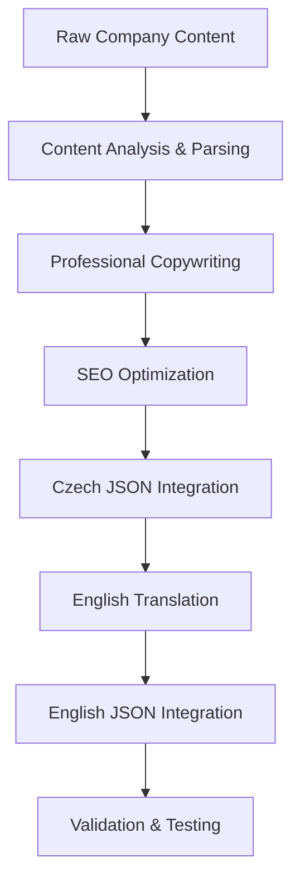

# Design Document

## Overview

The content integration feature will transform raw company content into professionally written, SEO-optimized copy and seamlessly integrate it into the existing Next.js i18n system. The design focuses on maintaining the current JSON structure while adding new content sections and enhancing existing ones.

## Architecture

### Content Processing Pipeline



### I18n Structure Enhancement

The existing i18n structure in `messages/cs.json` and `messages/en.json` will be enhanced with new sections while maintaining backward compatibility:

```json
{
  "existing_sections": "...",
  "home": {
    "hero": {
      "title": "...",
      "subtitle": "...",
      "description": "...",
      "cta": "..."
    },
    "philosophy": {
      "quote": "...",
      "text": "..."
    },
    "benefits": {
      "title": "...",
      "items": [
        {
          "title": "...",
          "description": "..."
        }
      ]
    }
  },
  "faq": {
    "title": "...",
    "items": [
      {
        "question": "...",
        "answer": "..."
      }
    ]
  },
  "about": {
    "title": "...",
    "mission": "...",
    "story": "...",
    "values": "..."
  },
  "seo": {
    "home": {
      "title": "...",
      "description": "...",
      "keywords": ["..."]
    },
    "products": {
      "title": "...",
      "description": "...",
      "keywords": ["..."]
    }
  }
}
```

## Components and Interfaces

### Content Sections

#### 1. Home Page Enhancement

- **Hero Section**: Professional headline with emotional resonance
- **Philosophy Section**: Refined version of the life transformation quote
- **Benefits Section**: Four key value propositions with trust-building focus
- **CTA Elements**: Conversion-optimized call-to-action buttons

#### 2. FAQ Section (New)

- **Question-Answer Pairs**: Three main FAQ items about wreath care
- **Expandable Format**: Structured for accordion-style display
- **SEO-Friendly**: Optimized for featured snippets

#### 3. About Section (Enhanced)

- **Company Story**: Professional narrative about the family business
- **Mission Statement**: Clear value proposition
- **Quality Commitment**: Trust-building content about craftsmanship

#### 4. Product Content Enhancement

- **Category Descriptions**: Enhanced product grid introductory text
- **Specification Labels**: Standardized size, color, and shape options
- **Product Names**: Butterfly-themed names (Pieris, Danaus, etc.)

### SEO Integration

#### Meta Data Structure

```typescript
interface SEOContent {
  title: string;
  description: string;
  keywords: string[];
  openGraph?: {
    title: string;
    description: string;
    image?: string;
  };
}
```

#### Keyword Strategy

- **Primary Keywords**: "pohřební věnce", "funeral wreaths"
- **Secondary Keywords**: "květinové aranžmá", "floral arrangements"
- **Long-tail Keywords**: "ruční výroba věnců", "handcrafted funeral wreaths"
- **Local SEO**: "Praha", "Czech Republic"

## Data Models

### Content Structure Model

```typescript
interface ContentSection {
  id: string;
  type: 'hero' | 'benefits' | 'faq' | 'about' | 'product';
  content: {
    cs: LocalizedContent;
    en: LocalizedContent;
  };
  seo: SEOContent;
}

interface LocalizedContent {
  title?: string;
  subtitle?: string;
  description?: string;
  items?: ContentItem[];
  cta?: string;
}

interface ContentItem {
  title: string;
  description: string;
  icon?: string;
}
```

### Translation Consistency Model

```typescript
interface TranslationPair {
  cs: string;
  en: string;
  context?: string;
  tone: 'formal' | 'empathetic' | 'professional' | 'conversational';
}
```

## Error Handling

### Content Validation

- **JSON Structure Validation**: Ensure proper nesting and required fields
- **Character Limit Validation**: SEO-appropriate lengths for titles and descriptions
- **Translation Completeness**: Verify all Czech content has English counterparts
- **Tone Consistency**: Maintain appropriate emotional tone across all content

### Fallback Strategies

- **Missing Translations**: Fall back to existing content or default messages
- **Invalid JSON**: Graceful degradation with error logging
- **SEO Failures**: Default meta tags if custom ones are malformed

## Testing Strategy

### Content Quality Assurance

1. **Linguistic Review**: Native speaker validation for both languages
2. **Tone Consistency**: Ensure empathetic and professional tone throughout
3. **SEO Validation**: Keyword density and meta tag optimization checks
4. **Conversion Testing**: A/B test key CTAs and value propositions

### Technical Testing

1. **JSON Validation**: Automated testing for proper JSON structure
2. **i18n Integration**: Verify seamless integration with existing system
3. **Component Rendering**: Test content display across all relevant components
4. **Performance Impact**: Ensure content additions don't affect load times

### User Experience Testing

1. **Readability**: Ensure content is easily scannable and digestible
2. **Emotional Resonance**: Validate appropriate tone for sensitive context
3. **Conversion Flow**: Test user journey from content to purchase
4. **Accessibility**: Ensure content works with screen readers and accessibility tools

## Implementation Considerations

### Content Management

- **Version Control**: Track content changes through Git
- **Review Process**: Implement approval workflow for content updates
- **Backup Strategy**: Maintain previous versions of content files
- **Update Mechanism**: Easy process for future content modifications

### Performance Optimization

- **Bundle Size**: Monitor impact of additional content on bundle size
- **Lazy Loading**: Consider lazy loading for non-critical content sections
- **Caching Strategy**: Implement appropriate caching for static content
- **CDN Integration**: Optimize content delivery for international users

### Maintenance Strategy

- **Content Audits**: Regular review of content relevance and accuracy
- **SEO Monitoring**: Track keyword performance and adjust as needed
- **Translation Updates**: Process for updating translations when content changes
- **Quality Metrics**: Monitor conversion rates and user engagement with new content
