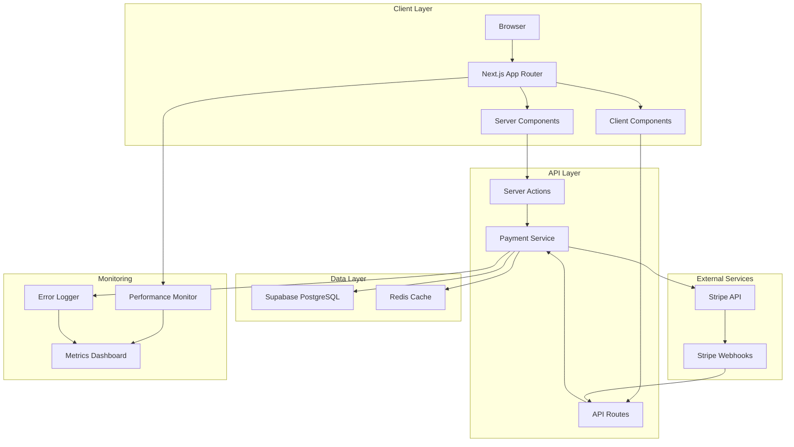

# Design Document

## Overview

This design document outlines the comprehensive approach to optimizing the funeral wreaths e-commerce platform and modernizing its Stripe payment integration. The design focuses on three main pillars:

1. **Performance Optimization**: Reducing bundle sizes, eliminating code duplication, and implementing modern Next.js 15 patterns
2. **Modern Stripe Integration**: Upgrading to latest Stripe APIs with Server Actions and improved error handling
3. **Developer Experience**: Faster builds, better tooling, and comprehensive monitoring

The design maintains backward compatibility while introducing modern patterns that align with Next.js 15, React 19, and Stripe's latest best practices.

## Architecture

### High-Level Architecture



### Component Architecture

The application follows a layered architecture:

1. **Presentation Layer**: Server and Client Components
2. **Business Logic Layer**: Server Actions and API Routes
3. **Service Layer**: Payment, Database, and Cache services
4. **Data Layer**: Supabase and Redis

## Components and Interfaces

### 1. Payment Service Modernization

#### Current Implementation Issues
- Uses older Stripe API version (2025-08-27.basil)
- Lacks proper retry logic
- Limited error handling
- No Server Actions integration
- Missing webhook event types

#### Proposed Design

```typescript
// src/lib/payments/stripe-service.ts
import Stripe from 'stripe';
import { cache } from 'react';

// Initialize with latest API version
export const stripe = new Stripe(process.env.STRIPE_SECRET_KEY!, {
  apiVersion: '2024-12-18.acacia',
  typescript: true,
  maxNetworkRetries: 3,
  timeout: 10000,
  appInfo: {
    name: 'Funeral Wreaths E-commerce',
    version: '1.0.0',
    url: 'https://vence-a-kvety.cz'
  }
});

// Server Action for creating payment intent
export async function createPaymentIntentAction(
  orderId: string,
  amount: number,
  currency: string = 'czk'
) {
  'use server';
  
  try {
    const paymentIntent = await stripe.paymentIntents.create({
      amount: Math.round(amount * 100),
      currency: currency.toLowerCase(),
      automatic_payment_methods: { enabled: true },
      metadata: { orderId },
      statement_descriptor: 'FUNERAL WREATHS',
    });
    
    return {
      success: true,
      clientSecret: paymentIntent.client_secret,
      paymentIntentId: paymentIntent.id
    };
  } catch (error) {
    return {
      success: false,
      error: sanitizeStripeError(error)
    };
  }
}

// Cached payment intent retrieval
export const getPaymentIntent = cache(async (paymentIntentId: string) => {
  return await stripe.paymentIntents.retrieve(paymentIntentId);
});
```

#### Webhook Handler Enhancement

```typescript
// src/app/api/payments/webhook/stripe/route.ts
import { headers } from 'next/headers';
import { stripe } from '@/lib/payments/stripe-service';
import { updateOrderStatus } from '@/lib/services/order-service';

export async function POST(request: Request) {
  const body = await request.text();
  const headersList = await headers();
  const signature = headersList.get('stripe-signature');
  
  if (!signature) {
    return Response.json({ error: 'No signature' }, { status: 400 });
  }
  
  try {
    const event = stripe.webhooks.constructEvent(
      body,
      signature,
      process.env.STRIPE_WEBHOOK_SECRET!
    );
    
    // Handle different event types
    switch (event.type) {
      case 'payment_intent.succeeded':
        await handlePaymentSuccess(event.data.object);
        break;
      case 'payment_intent.payment_failed':
        await handlePaymentFailure(event.data.object);
        break;
      case 'payment_intent.requires_action':
        await handleRequiresAction(event.data.object);
        break;
      default:
        console.log(`Unhandled event type: ${event.type}`);
    }
    
    return Response.json({ received: true });
  } catch (error) {
    console.error('Webhook error:', error);
    return Response.json(
      { error: 'Webhook processing failed' },
      { status: 400 }
    );
  }
}
```

### 2. Checkout Flow Optimization

#### Current Issues
- Mixed Server/Client component usage
- Unnecessary client-side state
- No progressive enhancement
- Large bundle size for checkout page

#### Proposed Design

```typescript
// src/app/[locale]/checkout/page.tsx (Server Component)
export default async function CheckoutPage({ params }: CheckoutPageProps) {
  const { locale } = await params;
  const cartItems = await getCartItems(); // Server-side fetch
  
  if (cartItems.length === 0) {
    redirect(`/${locale}/cart`);
  }
  
  return (
    <div className="checkout-container">
      <CheckoutSteps cartItems={cartItems} locale={locale} />
    </div>
  );
}

// src/components/checkout/CheckoutSteps.tsx (Server Component)
export async function CheckoutSteps({ cartItems, locale }: Props) {
  const t = await getTranslations({ locale, namespace: 'checkout' });
  
  return (
    <div className="steps-container">
      <Suspense fallback={<StepsSkeleton />}>
        <DeliveryStep />
      </Suspense>
      <Suspense fallback={<StepsSkeleton />}>
        <PaymentStep />
      </Suspense>
    </div>
  );
}

// src/components/checkout/PaymentStep.tsx (Client Component - only when needed)
'use client';

export function PaymentStep({ clientSecret }: Props) {
  // Lazy load Stripe Elements
  const StripeElements = lazy(() => import('./StripeElements'));
  
  return (
    <Suspense fallback={<PaymentSkeleton />}>
      <StripeElements clientSecret={clientSecret} />
    </Suspense>
  );
}
```

### 3. Bundle Optimization Strategy

#### Code Splitting Implementation

```typescript
// src/lib/config/dynamic-imports.ts
export const dynamicComponents = {
  // Admin components - only load when needed
  AdminDashboard: dynamic(() => import('@/components/admin/AdminDashboard'), {
    loading: () => <DashboardSkeleton />,
    ssr: false
  }),
  
  // Payment components - lazy load
  StripePaymentForm: dynamic(() => import('@/components/payments/StripePaymentForm'), {
    loading: () => <PaymentSkeleton />,
    ssr: false
  }),
  
  // Heavy libraries
  ProductQuickView: dynamic(() => import('@/components/product/ProductQuickView'), {
    loading: () => <QuickViewSkeleton />
  }),
  
  // Monitoring - only in production
  MonitoringDashboard: dynamic(() => import('@/components/monitoring/MonitoringDashboard'), {
    loading: () => <div>Loading...</div>,
    ssr: false
  })
};
```

#### Webpack Configuration Enhancement

```typescript
// next.config.ts
const config: NextConfig = {
  webpack: (config, { isServer, dev }) => {
    // Optimize bundle splitting
    if (!isServer && !dev) {
      config.optimization = {
        ...config.optimization,
        splitChunks: {
          chunks: 'all',
          cacheGroups: {
            // Stripe bundle
            stripe: {
              test: /[\\/]node_modules[\\/](@stripe)[\\/]/,
              name: 'stripe',
              priority: 30,
              reuseExistingChunk: true
            },
            // Supabase bundle
            supabase: {
              test: /[\\/]node_modules[\\/](@supabase)[\\/]/,
              name: 'supabase',
              priority: 25,
              reuseExistingChunk: true
            },
            // React bundle
            react: {
              test: /[\\/]node_modules[\\/](react|react-dom)[\\/]/,
              name: 'react',
              priority: 20,
              reuseExistingChunk: true
            },
            // Common vendor bundle
            vendor: {
              test: /[\\/]node_modules[\\/]/,
              name: 'vendor',
              priority: 10,
              reuseExistingChunk: true,
              minChunks: 2
            }
          }
        },
        // Minimize runtime chunk
        runtimeChunk: {
          name: 'runtime'
        }
      };
    }
    
    return config;
  }
};
```

### 4. Performance Monitoring Integration

#### Core Web Vitals Tracking

```typescript
// src/lib/monitoring/web-vitals.ts
'use client';

import { onCLS, onFID, onLCP, onFCP, onTTFB } from 'web-vitals';

export function initWebVitals() {
  onCLS(sendToAnalytics);
  onFID(sendToAnalytics);
  onLCP(sendToAnalytics);
  onFCP(sendToAnalytics);
  onTTFB(sendToAnalytics);
}

function sendToAnalytics(metric: Metric) {
  // Send to monitoring service
  if (typeof window !== 'undefined') {
    fetch('/api/monitoring/vitals', {
      method: 'POST',
      body: JSON.stringify(metric),
      headers: { 'Content-Type': 'application/json' }
    }).catch(console.error);
  }
}
```

#### Payment Error Monitoring

```typescript
// src/lib/monitoring/payment-monitor.ts
export class PaymentMonitor {
  static logPaymentAttempt(orderId: string, amount: number) {
    console.log('[Payment] Attempt:', { orderId, amount, timestamp: Date.now() });
  }
  
  static logPaymentSuccess(orderId: string, paymentIntentId: string) {
    console.log('[Payment] Success:', { orderId, paymentIntentId });
    // Send to monitoring service
  }
  
  static logPaymentError(orderId: string, error: unknown) {
    const sanitizedError = sanitizeError(error);
    console.error('[Payment] Error:', { orderId, error: sanitizedError });
    // Send to error tracking service
  }
}
```

## Data Models

### Payment Intent Metadata

```typescript
interface PaymentIntentMetadata {
  orderId: string;
  customerEmail: string;
  customerName: string;
  locale: string;
  cartItemCount: number;
  deliveryMethod: string;
}
```

### Order Status Updates

```typescript
interface OrderStatusUpdate {
  orderId: string;
  status: 'pending' | 'processing' | 'paid' | 'failed' | 'cancelled';
  paymentIntentId?: string;
  transactionId?: string;
  errorMessage?: string;
  updatedAt: Date;
}
```

### Performance Metrics

```typescript
interface PerformanceMetric {
  name: 'LCP' | 'FID' | 'CLS' | 'FCP' | 'TTFB';
  value: number;
  rating: 'good' | 'needs-improvement' | 'poor';
  delta: number;
  id: string;
  navigationType: string;
}
```

## Error Handling

### Stripe Error Handling Strategy

```typescript
// src/lib/payments/error-handler.ts
export function sanitizeStripeError(error: unknown): string {
  if (error instanceof Stripe.errors.StripeCardError) {
    // Card errors - safe to show to user
    return error.message;
  }
  
  if (error instanceof Stripe.errors.StripeInvalidRequestError) {
    // Invalid parameters - log but don't expose
    console.error('Invalid Stripe request:', error);
    return 'Payment configuration error. Please contact support.';
  }
  
  if (error instanceof Stripe.errors.StripeAPIError) {
    // API errors - temporary issues
    return 'Payment service temporarily unavailable. Please try again.';
  }
  
  if (error instanceof Stripe.errors.StripeConnectionError) {
    // Network errors
    return 'Connection error. Please check your internet and try again.';
  }
  
  if (error instanceof Stripe.errors.StripeAuthenticationError) {
    // Authentication errors - critical, log immediately
    console.error('Stripe authentication error:', error);
    return 'Payment system error. Please contact support.';
  }
  
  // Unknown errors - don't expose details
  console.error('Unknown payment error:', error);
  return 'An unexpected error occurred. Please try again or contact support.';
}
```

### Retry Logic

```typescript
// src/lib/payments/retry-handler.ts
export async function withRetry<T>(
  fn: () => Promise<T>,
  options: RetryOptions = {}
): Promise<T> {
  const {
    maxRetries = 3,
    delayMs = 1000,
    backoff = 2,
    shouldRetry = () => true
  } = options;
  
  let lastError: unknown;
  
  for (let attempt = 0; attempt <= maxRetries; attempt++) {
    try {
      return await fn();
    } catch (error) {
      lastError = error;
      
      if (attempt === maxRetries || !shouldRetry(error)) {
        throw error;
      }
      
      const delay = delayMs * Math.pow(backoff, attempt);
      await new Promise(resolve => setTimeout(resolve, delay));
    }
  }
  
  throw lastError;
}
```

## Testing Strategy

### Unit Tests

```typescript
// src/lib/payments/__tests__/stripe-service.test.ts
describe('Stripe Service', () => {
  describe('createPaymentIntentAction', () => {
    it('should create payment intent with correct amount', async () => {
      const result = await createPaymentIntentAction('order-123', 100, 'czk');
      expect(result.success).toBe(true);
      expect(result.clientSecret).toBeDefined();
    });
    
    it('should handle Stripe errors gracefully', async () => {
      // Mock Stripe error
      const result = await createPaymentIntentAction('invalid', -1, 'czk');
      expect(result.success).toBe(false);
      expect(result.error).toBeDefined();
    });
  });
  
  describe('webhook handling', () => {
    it('should verify webhook signature', async () => {
      const payload = JSON.stringify({ type: 'payment_intent.succeeded' });
      const signature = generateTestSignature(payload);
      
      const response = await POST(
        new Request('http://localhost/api/payments/webhook/stripe', {
          method: 'POST',
          body: payload,
          headers: { 'stripe-signature': signature }
        })
      );
      
      expect(response.status).toBe(200);
    });
  });
});
```

### Integration Tests

```typescript
// src/app/[locale]/checkout/__tests__/checkout-flow.test.tsx
describe('Checkout Flow', () => {
  it('should complete full checkout process', async () => {
    // 1. Add items to cart
    // 2. Navigate to checkout
    // 3. Fill delivery information
    // 4. Select payment method
    // 5. Complete payment with test card
    // 6. Verify order creation
    // 7. Verify confirmation email
  });
});
```

### Performance Tests

```typescript
// scripts/performance-tests.ts
describe('Performance Benchmarks', () => {
  it('should load homepage in under 2 seconds', async () => {
    const metrics = await measurePageLoad('/');
    expect(metrics.LCP).toBeLessThan(2000);
  });
  
  it('should have bundle size under 200KB', async () => {
    const bundleSize = await analyzeBundleSize();
    expect(bundleSize.main).toBeLessThan(200 * 1024);
  });
});
```

## Security Considerations

### PCI DSS Compliance

1. **Never store card data**: Use Stripe Elements exclusively
2. **Secure API keys**: Environment variables only, never in code
3. **Webhook verification**: Always verify signatures
4. **HTTPS only**: Enforce SSL in production
5. **Rate limiting**: Implement on payment endpoints

### Environment Variables

```bash
# Required Stripe variables
STRIPE_SECRET_KEY=sk_live_...
NEXT_PUBLIC_STRIPE_PUBLISHABLE_KEY=pk_live_...
STRIPE_WEBHOOK_SECRET=whsec_...

# Optional Stripe variables
STRIPE_API_VERSION=2024-12-18.acacia
STRIPE_MAX_NETWORK_RETRIES=3
```

### CSP Headers

```typescript
// next.config.ts
const ContentSecurityPolicy = `
  script-src 'self' 'unsafe-inline' 'unsafe-eval' https://js.stripe.com;
  frame-src 'self' https://js.stripe.com https://hooks.stripe.com;
  connect-src 'self' https://api.stripe.com;
`;
```

## Deployment Strategy

### Build Optimization

1. **Pre-build checks**:
   - TypeScript compilation
   - Bundle size analysis
   - Performance benchmarks

2. **Build process**:
   - Static page generation for product pages
   - Dynamic routes for checkout
   - API routes optimization

3. **Post-build validation**:
   - Bundle size comparison
   - Lighthouse scores
   - Critical path analysis

### Rollout Plan

1. **Phase 1**: Performance optimizations (no breaking changes)
2. **Phase 2**: Stripe API upgrade (backward compatible)
3. **Phase 3**: Server Actions migration (gradual)
4. **Phase 4**: Bundle optimization (monitoring required)

## Monitoring and Observability

### Metrics to Track

1. **Performance Metrics**:
   - Core Web Vitals (LCP, FID, CLS)
   - Bundle sizes
   - Build times
   - Page load times

2. **Payment Metrics**:
   - Payment success rate
   - Payment failure reasons
   - Average payment time
   - 3D Secure completion rate

3. **Error Metrics**:
   - Error rates by type
   - Payment errors
   - API errors
   - Client-side errors

### Alerting Strategy

```typescript
// src/lib/monitoring/alerts.ts
export const alertThresholds = {
  paymentFailureRate: 0.05, // Alert if > 5% failures
  pageLoadTime: 3000, // Alert if > 3s
  bundleSizeIncrease: 0.1, // Alert if > 10% increase
  errorRate: 0.01 // Alert if > 1% errors
};
```

## Migration Path

### From Current to Optimized

1. **Audit Phase** (Week 1):
   - Identify duplicate code
   - Find unused files
   - Analyze bundle composition
   - Review component architecture

2. **Optimization Phase** (Week 2-3):
   - Remove duplicates
   - Delete unused files
   - Implement code splitting
   - Optimize imports

3. **Stripe Upgrade Phase** (Week 4):
   - Update Stripe SDK
   - Implement Server Actions
   - Enhance webhook handling
   - Add retry logic

4. **Testing Phase** (Week 5):
   - Unit tests
   - Integration tests
   - Performance tests
   - Security audit

5. **Deployment Phase** (Week 6):
   - Staged rollout
   - Monitor metrics
   - Gather feedback
   - Iterate

## Success Criteria

### Performance Targets

- **Bundle Size**: < 200KB for main bundle
- **LCP**: < 2.5s on 3G
- **FID**: < 100ms
- **CLS**: < 0.1
- **Build Time**: < 3 minutes
- **Dev Server Start**: < 5 seconds

### Payment Targets

- **Success Rate**: > 95%
- **Payment Time**: < 10s average
- **Error Recovery**: < 5% abandoned after error
- **3D Secure**: > 90% completion rate

### Code Quality Targets

- **Test Coverage**: > 80%
- **TypeScript Errors**: 0
- **Duplicate Code**: < 5%
- **Unused Files**: 0
- **Bundle Duplication**: < 10%
