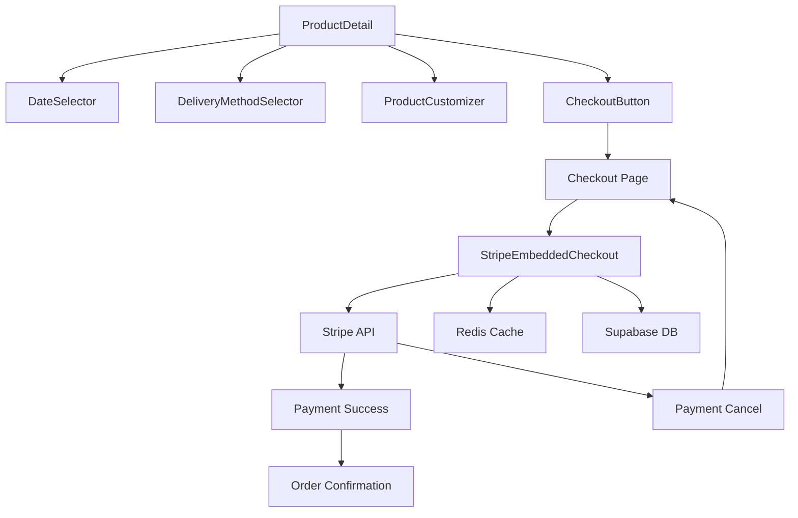
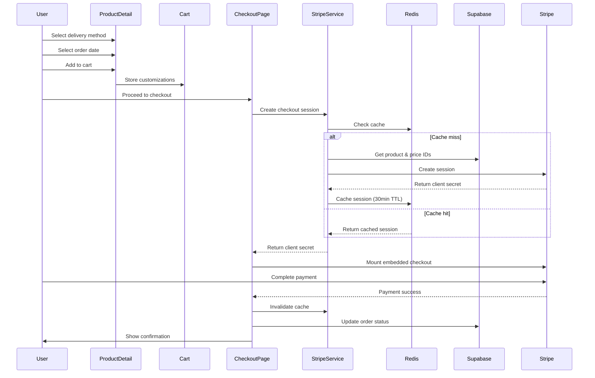

# Design Document

## Overview

This design document outlines the technical approach for enhancing the product customization flow and implementing Stripe Embedded Checkout for the funeral wreaths e-commerce platform. The solution focuses on three main areas:

1. **DateSelector UI Improvements** - Simplifying the date selection interface by removing unnecessary input fields and standardizing headers
2. **Delivery Method Selection** - Adding a new customization option for customers to choose between home delivery (free) and personal pickup
3. **Stripe Embedded Checkout Integration** - Implementing modern, embedded payment flow with proper caching and error handling

The design maintains compatibility with existing systems while introducing modern payment capabilities and improved user experience.

## Architecture

### High-Level Component Structure



### Data Flow



## Components and Interfaces

### 1. DateSelector Component Modifications

**File**: `src/components/product/DateSelector.tsx`

**Changes**:
- Remove the input message field that currently appears below the calendar
- Update the component to accept a `header` prop for customizable titles
- Maintain all existing calendar functionality

**Interface**:
```typescript
interface DateSelectorProps {
  value?: string;
  onChange: (date: string) => void;
  minDaysFromNow?: number;
  maxDaysFromNow?: number;
  locale: string;
  header?: string; // New prop for customizable header
  className?: string;
}
```

**Implementation Notes**:
- The validation message showing the selected date should remain
- Calendar interaction and date range enforcement stays unchanged
- Header defaults to translated "Order date" if not provided

### 2. Delivery Method Selector Component

**New File**: `src/components/product/DeliveryMethodSelector.tsx`

**Purpose**: Provides a choice between delivery to address and personal pickup

**Interface**:
```typescript
interface DeliveryMethodSelectorProps {
  value?: 'delivery' | 'pickup';
  onChange: (method: 'delivery' | 'pickup') => void;
  locale: string;
  className?: string;
}

interface DeliveryMethod {
  id: 'delivery' | 'pickup';
  label: { cs: string; en: string };
  description: { cs: string; en: string };
  badge?: { cs: string; en: string }; // For "Free delivery"
  icon: React.ReactNode;
}
```

**Design**:
- Two radio button options with clear visual distinction
- "Delivery to address" option shows "Free delivery" badge
- "Personal pickup" option shows company address and hours
- Integrates with existing customization system
- Responsive design for mobile and desktop

**Translation Keys** (to be added to `messages/cs.json` and `messages/en.json`):
```json
{
  "product": {
    "deliveryMethod": {
      "title": "Delivery method",
      "delivery": {
        "label": "Delivery to address",
        "description": "We will deliver to your specified address",
        "badge": "Free delivery"
      },
      "pickup": {
        "label": "Personal pickup",
        "description": "Pick up at our office",
        "address": "Company Address, Prague",
        "hours": "Mon-Fri: 9:00-17:00"
      },
      "required": "Please select a delivery method"
    }
  }
}
```

### 3. ProductDetail Component Updates

**File**: `src/components/product/ProductDetail.tsx`

**Changes**:
1. Add delivery method selection section
2. Update DateSelector usage to include header prop
3. Integrate delivery method into customizations
4. Update validation to require delivery method selection

**New State**:
```typescript
const [deliveryMethod, setDeliveryMethod] = useState<'delivery' | 'pickup' | null>(null);
```

**Customization Integration**:
```typescript
// Add delivery method to customizations when adding to cart
const allCustomizations = [
  ...customizations,
  {
    optionId: 'delivery_method',
    choiceIds: [deliveryMethod === 'delivery' ? 'delivery_address' : 'personal_pickup'],
  },
];
```

### 4. ProductCustomizer Component Updates

**File**: `src/components/product/ProductCustomizer.tsx`

**Changes**:
- Update header rendering logic to use option-specific titles
- Remove generic "Customize" header for date selection
- Use "Order date" for date-related customization options

**Header Logic**:
```typescript
const getOptionHeader = (option: CustomizationOption): string => {
  if (option.type === 'date' || option.requiresCalendar) {
    return t('orderDate');
  }
  if (option.type === 'ribbon') {
    return t('ribbon');
  }
  if (option.type === 'size') {
    return t('size');
  }
  // Default to option name
  return typeof option.name === 'object'
    ? option.name[locale as keyof typeof option.name] || option.name.cs
    : option.name;
};
```

### 5. Stripe Embedded Checkout Service

**New File**: `src/lib/stripe/embedded-checkout.ts`

**Purpose**: Handles Stripe Embedded Checkout session creation and caching

**Interface**:
```typescript
interface CreateCheckoutSessionParams {
  cartItems: CartItem[];
  locale: 'cs' | 'en';
  customerId?: string;
  metadata?: Record<string, string>;
}

interface CheckoutSessionResponse {
  clientSecret: string;
  sessionId: string;
}

interface CachedCheckoutSession {
  clientSecret: string;
  sessionId: string;
  expiresAt: number;
}
```

**Key Functions**:

```typescript
/**
 * Creates or retrieves a cached Stripe Embedded Checkout session
 * @param params - Checkout session parameters
 * @returns Client secret and session ID
 */
export async function createEmbeddedCheckoutSession(
  params: CreateCheckoutSessionParams
): Promise<CheckoutSessionResponse>;

/**
 * Invalidates a cached checkout session
 * @param sessionId - Stripe session ID to invalidate
 */
export async function invalidateCheckoutSession(sessionId: string): Promise<void>;

/**
 * Retrieves product and price IDs from Supabase
 * @param productId - Product ID
 * @param customizations - Product customizations
 * @returns Stripe product and price IDs
 */
async function getStripeIds(
  productId: string,
  customizations: Customization[]
): Promise<{ productId: string; priceId: string }>;
```

**Caching Strategy**:
- Cache key format: `checkout:session:{cartHash}`
- TTL: 30 minutes (1800 seconds)
- Cache invalidation on:
  - Payment success
  - Payment cancellation
  - Session expiration
  - Cart modification

**Error Handling**:
- Retry logic with exponential backoff (3 attempts)
- Graceful fallback if cache fails
- User-friendly error messages
- Detailed logging for debugging

### 6. Stripe Embedded Checkout Component

**New File**: `src/components/payments/StripeEmbeddedCheckout.tsx`

**Purpose**: React component that renders Stripe's embedded checkout

**Interface**:
```typescript
interface StripeEmbeddedCheckoutProps {
  clientSecret: string;
  onComplete?: () => void;
  onError?: (error: Error) => void;
  locale: 'cs' | 'en';
}
```

**Implementation**:
```typescript
'use client';

import { EmbeddedCheckoutProvider, EmbeddedCheckout } from '@stripe/react-stripe-js';
import { loadStripe } from '@stripe/stripe-js';
import { useEffect, useState } from 'react';

const stripePromise = loadStripe(process.env.NEXT_PUBLIC_STRIPE_PUBLISHABLE_KEY!);

export function StripeEmbeddedCheckout({
  clientSecret,
  onComplete,
  onError,
  locale,
}: StripeEmbeddedCheckoutProps) {
  const [isLoading, setIsLoading] = useState(true);

  const fetchClientSecret = async () => {
    return clientSecret;
  };

  const handleComplete = () => {
    setIsLoading(false);
    onComplete?.();
  };

  return (
    <div className="stripe-embedded-checkout-container">
      {isLoading && (
        <div className="loading-overlay">
          <LoadingSpinner />
          <p>{locale === 'cs' ? 'Načítání platební brány...' : 'Loading payment gateway...'}</p>
        </div>
      )}
      <EmbeddedCheckoutProvider
        stripe={stripePromise}
        options={{
          fetchClientSecret,
          onComplete: handleComplete,
        }}
      >
        <EmbeddedCheckout />
      </EmbeddedCheckoutProvider>
    </div>
  );
}
```

### 7. Checkout Page Updates

**File**: `src/app/[locale]/checkout/page.tsx`

**Changes**:
1. Add Stripe Embedded Checkout integration
2. Handle delivery method display
3. Implement session caching
4. Add success/cancel handling

**Flow**:
```typescript
export default async function CheckoutPage({ params }: { params: { locale: string } }) {
  const cart = await getCart();
  
  if (!cart || cart.items.length === 0) {
    redirect(`/${params.locale}/cart`);
  }

  // Check if delivery method is selected
  const hasDeliveryMethod = cart.items.some(item =>
    item.customizations?.some(c => c.optionId === 'delivery_method')
  );

  if (!hasDeliveryMethod) {
    // Redirect back to cart with error message
    redirect(`/${params.locale}/cart?error=delivery_method_required`);
  }

  // Create checkout session
  const session = await createEmbeddedCheckoutSession({
    cartItems: cart.items,
    locale: params.locale as 'cs' | 'en',
    metadata: {
      cartId: cart.id,
    },
  });

  return (
    <div className="checkout-container">
      <CheckoutSummary cart={cart} locale={params.locale} />
      <StripeEmbeddedCheckout
        clientSecret={session.clientSecret}
        onComplete={() => handleCheckoutComplete(session.sessionId)}
        locale={params.locale as 'cs' | 'en'}
      />
    </div>
  );
}
```

## Data Models

### Customization Type Extension

**File**: `src/types/product.ts`

**New Customization Option Type**:
```typescript
interface DeliveryMethodOption extends CustomizationOption {
  type: 'delivery_method';
  choices: [
    {
      id: 'delivery_address';
      label: { cs: string; en: string };
      priceModifier: 0; // Free delivery
    },
    {
      id: 'personal_pickup';
      label: { cs: string; en: string };
      priceModifier: 0;
    }
  ];
}
```

### Checkout Session Cache Schema

**Redis Key Structure**:
```
checkout:session:{cartHash} -> {
  clientSecret: string,
  sessionId: string,
  expiresAt: number,
  cartItems: CartItem[],
  createdAt: number
}
```

**Cart Hash Generation**:
```typescript
function generateCartHash(items: CartItem[]): string {
  const sortedItems = items
    .map(item => ({
      productId: item.productId,
      quantity: item.quantity,
      customizations: item.customizations?.sort((a, b) => 
        a.optionId.localeCompare(b.optionId)
      ),
    }))
    .sort((a, b) => a.productId.localeCompare(b.productId));
  
  return createHash('sha256')
    .update(JSON.stringify(sortedItems))
    .digest('hex')
    .substring(0, 16);
}
```

### Database Schema Updates

**Migration**: `supabase/migrations/20250110000000_add_delivery_method_support.sql`

**Changes**:
1. Add delivery method tracking to orders table
2. Add pickup location information

```sql
-- Add delivery method column to orders table
ALTER TABLE orders
ADD COLUMN IF NOT EXISTS delivery_method TEXT CHECK (delivery_method IN ('delivery', 'pickup'));

-- Add pickup location info
ALTER TABLE orders
ADD COLUMN IF NOT EXISTS pickup_location TEXT;

-- Add index for delivery method queries
CREATE INDEX IF NOT EXISTS idx_orders_delivery_method ON orders(delivery_method);

-- Update existing orders to have default delivery method
UPDATE orders
SET delivery_method = 'delivery'
WHERE delivery_method IS NULL;
```

## Error Handling

### Error Categories

1. **Validation Errors**
   - Missing delivery method
   - Missing required customizations
   - Invalid date selection

2. **Stripe API Errors**
   - Session creation failure
   - Payment processing errors
   - Network timeouts

3. **Cache Errors**
   - Redis connection failures
   - Cache retrieval errors
   - Serialization errors

4. **Database Errors**
   - Missing Stripe IDs
   - Product not found
   - Order creation failure

### Error Handling Strategy

**File**: `src/lib/stripe/error-handler.ts`

```typescript
export class CheckoutError extends Error {
  constructor(
    message: string,
    public code: string,
    public userMessage: { cs: string; en: string },
    public retryable: boolean = false
  ) {
    super(message);
    this.name = 'CheckoutError';
  }
}

export function handleStripeError(error: unknown, locale: 'cs' | 'en'): CheckoutError {
  if (error instanceof Stripe.errors.StripeError) {
    switch (error.type) {
      case 'card_error':
        return new CheckoutError(
          error.message,
          'CARD_ERROR',
          {
            cs: 'Platba byla zamítnuta. Zkontrolujte údaje karty.',
            en: 'Payment was declined. Please check your card details.',
          },
          true
        );
      
      case 'api_connection_error':
        return new CheckoutError(
          error.message,
          'NETWORK_ERROR',
          {
            cs: 'Problém s připojením. Zkuste to prosím znovu.',
            en: 'Connection problem. Please try again.',
          },
          true
        );
      
      default:
        return new CheckoutError(
          error.message,
          'STRIPE_ERROR',
          {
            cs: 'Nastala chyba při zpracování platby.',
            en: 'An error occurred while processing payment.',
          },
          false
        );
    }
  }
  
  return new CheckoutError(
    'Unknown error',
    'UNKNOWN_ERROR',
    {
      cs: 'Nastala neočekávaná chyba.',
      en: 'An unexpected error occurred.',
    },
    false
  );
}
```

### Retry Logic

```typescript
async function withRetry<T>(
  fn: () => Promise<T>,
  maxAttempts: number = 3,
  delayMs: number = 1000
): Promise<T> {
  let lastError: Error;
  
  for (let attempt = 1; attempt <= maxAttempts; attempt++) {
    try {
      return await fn();
    } catch (error) {
      lastError = error as Error;
      
      if (attempt < maxAttempts) {
        // Exponential backoff
        await new Promise(resolve => setTimeout(resolve, delayMs * Math.pow(2, attempt - 1)));
      }
    }
  }
  
  throw lastError!;
}
```

## Testing Strategy

### Unit Tests

1. **DateSelector Component**
   - Header prop rendering
   - Date selection functionality
   - Validation message display

2. **DeliveryMethodSelector Component**
   - Option selection
   - Badge display
   - Localization

3. **Stripe Service**
   - Session creation
   - Cache hit/miss scenarios
   - Error handling
   - Retry logic

4. **Error Handler**
   - Error categorization
   - Message localization
   - Retry determination

### Integration Tests

1. **Checkout Flow**
   - Complete checkout with delivery
   - Complete checkout with pickup
   - Payment success handling
   - Payment cancellation handling

2. **Cache Integration**
   - Session caching
   - Cache invalidation
   - Cache expiration

3. **Database Integration**
   - Stripe ID retrieval
   - Order creation with delivery method
   - Order status updates

### E2E Tests

1. **Full Purchase Flow**
   - Product selection
   - Customization
   - Delivery method selection
   - Checkout
   - Payment completion

2. **Error Scenarios**
   - Missing delivery method
   - Payment failure
   - Network errors
   - Session expiration

## Performance Considerations

### Caching Strategy

1. **Checkout Session Caching**
   - 30-minute TTL
   - Cart-based cache keys
   - Automatic invalidation

2. **Product Data Caching**
   - Cache Stripe IDs with product data
   - Invalidate on product updates

### Lazy Loading

1. **Stripe SDK**
   - Load only when checkout page is accessed
   - Use dynamic imports

2. **Embedded Checkout Component**
   - Lazy load with React.lazy
   - Show loading state during initialization

### Bundle Optimization

- Stripe SDK loaded separately
- Checkout components code-split
- Minimal dependencies in critical path

## Security Considerations

### PCI Compliance

- All payment data handled by Stripe
- No card data touches our servers
- Embedded checkout maintains PCI compliance

### API Key Management

- Publishable key in environment variables
- Secret key never exposed to client
- Webhook signature verification

### CSRF Protection

- Checkout sessions tied to user sessions
- Session validation on server
- Metadata verification

### Rate Limiting

- Checkout session creation rate limited
- Per-user and per-IP limits
- Prevent abuse and DoS

## Deployment Strategy

### Phase 1: DateSelector and Delivery Method (Low Risk)

1. Deploy DateSelector UI changes
2. Deploy DeliveryMethodSelector component
3. Update ProductDetail to include delivery selection
4. Run A/B test with 10% of users

### Phase 2: Stripe Embedded Checkout (Medium Risk)

1. Deploy Stripe service with caching
2. Deploy embedded checkout component
3. Enable for test users only
4. Monitor error rates and performance
5. Gradual rollout: 10% → 25% → 50% → 100%

### Phase 3: Database Migration (Low Risk)

1. Run migration in staging
2. Verify data integrity
3. Run migration in production during low-traffic period
4. Monitor for issues

### Rollback Plan

- Feature flags for each component
- Database migration is additive (no data loss)
- Cache can be cleared without impact
- Stripe sessions expire automatically

## Monitoring and Observability

### Metrics to Track

1. **Checkout Performance**
   - Session creation time
   - Cache hit rate
   - Payment success rate
   - Error rate by type

2. **User Behavior**
   - Delivery method selection distribution
   - Checkout abandonment rate
   - Time to complete checkout

3. **System Health**
   - Redis connection status
   - Stripe API latency
   - Database query performance

### Logging

```typescript
// Structured logging for checkout events
logger.info('checkout_session_created', {
  sessionId,
  cartHash,
  itemCount,
  deliveryMethod,
  cached: false,
  duration: Date.now() - startTime,
});

logger.error('checkout_session_failed', {
  error: error.message,
  code: error.code,
  retryable: error.retryable,
  attempt,
});
```

### Alerts

1. **Critical**
   - Checkout success rate < 95%
   - Stripe API error rate > 5%
   - Cache failure rate > 10%

2. **Warning**
   - Checkout session creation time > 2s
   - Cache hit rate < 70%
   - Payment failure rate > 10%

## Localization

### Translation Keys

**File**: `messages/cs.json` and `messages/en.json`

```json
{
  "product": {
    "orderDate": "Datum objednávky / Order date",
    "deliveryMethod": {
      "title": "Způsob doručení / Delivery method",
      "delivery": {
        "label": "Doručení na adresu / Delivery to address",
        "description": "Doručíme na vámi uvedenou adresu / We will deliver to your specified address",
        "badge": "Doprava zdarma / Free delivery"
      },
      "pickup": {
        "label": "Osobní odběr / Personal pickup",
        "description": "Vyzvedněte si v naší provozovně / Pick up at our office",
        "address": "Adresa provozovny, Praha / Company Address, Prague",
        "hours": "Po-Pá: 9:00-17:00 / Mon-Fri: 9:00-17:00"
      },
      "required": "Vyberte prosím způsob doručení / Please select a delivery method"
    }
  },
  "checkout": {
    "loading": "Načítání platební brány... / Loading payment gateway...",
    "processing": "Zpracování platby... / Processing payment...",
    "success": "Platba byla úspěšná / Payment successful",
    "error": {
      "generic": "Nastala chyba při zpracování platby / An error occurred while processing payment",
      "network": "Problém s připojením. Zkuste to prosím znovu. / Connection problem. Please try again.",
      "card": "Platba byla zamítnuta. Zkontrolujte údaje karty. / Payment was declined. Please check your card details.",
      "session_expired": "Platební relace vypršela. Vytvářím novou... / Payment session expired. Creating new one..."
    }
  }
}
```

## Accessibility

### WCAG 2.1 AA Compliance

1. **Keyboard Navigation**
   - All interactive elements keyboard accessible
   - Logical tab order
   - Focus indicators visible

2. **Screen Reader Support**
   - ARIA labels for all controls
   - Status announcements for loading states
   - Error messages announced

3. **Visual Design**
   - Sufficient color contrast (4.5:1 minimum)
   - Text alternatives for icons
   - Clear focus states

### Implementation

```typescript
// DeliveryMethodSelector with accessibility
<div role="radiogroup" aria-labelledby="delivery-method-label">
  <h3 id="delivery-method-label">{t('deliveryMethod.title')}</h3>
  
  <button
    role="radio"
    aria-checked={value === 'delivery'}
    aria-describedby="delivery-description"
    onClick={() => onChange('delivery')}
  >
    <span id="delivery-description">
      {t('deliveryMethod.delivery.description')}
    </span>
  </button>
  
  <button
    role="radio"
    aria-checked={value === 'pickup'}
    aria-describedby="pickup-description"
    onClick={() => onChange('pickup')}
  >
    <span id="pickup-description">
      {t('deliveryMethod.pickup.description')}
    </span>
  </button>
</div>
```

## Future Enhancements

1. **Multiple Delivery Options**
   - Express delivery (paid)
   - Scheduled delivery windows
   - Multiple pickup locations

2. **Payment Methods**
   - Apple Pay / Google Pay
   - Bank transfers
   - Payment installments

3. **Advanced Caching**
   - Predictive session creation
   - Background session refresh
   - Multi-region caching

4. **Analytics**
   - Conversion funnel tracking
   - A/B testing framework
   - User behavior heatmaps
