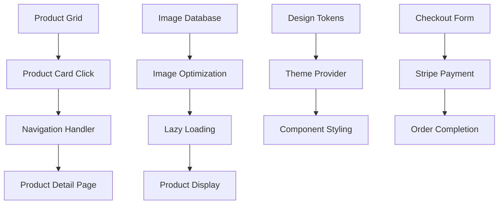

# Design Document

## Overview

This design document outlines the comprehensive solution for fixing product grid routing issues, implementing proper image rendering, creating a modern theming system, and streamlining the checkout process. The solution focuses on production-ready code with modern React patterns, TypeScript safety, and optimal user experience.

## Architecture

### Component Architecture

The solution follows atomic design principles with clear separation of concerns:

```
src/
├── components/
│   ├── product/
│   │   ├── ProductGrid.tsx (enhanced routing)
│   │   ├── ProductCard.tsx (fixed navigation)
│   │   └── ProductImageGallery.tsx (optimized rendering)
│   ├── checkout/
│   │   ├── CheckoutForm.tsx (Stripe-only)
│   │   └── steps/PaymentStep.tsx (simplified)
│   └── ui/ (theme-aware components)
├── lib/
│   ├── design-system/
│   │   ├── tokens.ts (centralized design tokens)
│   │   ├── theme.ts (theme configuration)
│   │   └── colors.ts (semantic color system)
│   └── payments/
│       └── stripe.ts (single payment provider)
└── styles/
    └── globals.css (CSS custom properties)
```

### Data Flow Architecture



## Components and Interfaces

### 1. Enhanced Product Grid System

#### ProductCard Component Enhancement

```typescript
interface ProductCardProps {
  product: Product;
  locale: string;
  onAddToCart?: (product: Product) => void;
  className?: string;
  featured?: boolean;
  viewMode?: 'grid' | 'list';
}

interface NavigationHandler {
  handleProductClick: (product: Product, event: React.MouseEvent) => void;
  handleImageClick: (product: Product, event: React.MouseEvent) => void;
  handleTitleClick: (product: Product, event: React.MouseEvent) => void;
}
```

#### Image Rendering System

```typescript
interface ProductImageProps {
  product: Product;
  priority?: boolean;
  sizes?: string;
  className?: string;
}

interface ImageOptimization {
  src: string;
  alt: string;
  fallback: string;
  loading: 'lazy' | 'eager';
  placeholder: 'blur' | 'empty';
}
```

### 2. Modern Theming System

#### Design Token Structure

```typescript
interface DesignTokens {
  colors: {
    primary: ColorScale;
    secondary: ColorScale;
    accent: ColorScale;
    neutral: ColorScale;
    semantic: SemanticColors;
  };
  typography: TypographyScale;
  spacing: SpacingScale;
  shadows: ShadowScale;
  borderRadius: BorderRadiusScale;
}

interface ColorScale {
  50: string;
  100: string;
  200: string;
  // ... up to 950
}

interface SemanticColors {
  success: ColorVariants;
  warning: ColorVariants;
  error: ColorVariants;
  info: ColorVariants;
}
```

#### Theme Provider Implementation

```typescript
interface ThemeContextValue {
  theme: 'light' | 'dark';
  tokens: DesignTokens;
  setTheme: (theme: 'light' | 'dark') => void;
}
```

### 3. Streamlined Checkout System

#### Simplified Payment Interface

```typescript
interface PaymentStepProps {
  orderData: OrderData;
  onPaymentSuccess: (paymentResult: StripePaymentResult) => void;
  onPaymentError: (error: PaymentError) => void;
}

interface StripePaymentConfig {
  publishableKey: string;
  appearance: StripeAppearance;
  options: StripeElementsOptions;
}
```

## Data Models

### Enhanced Product Model

```typescript
interface Product {
  id: string;
  slug: string;
  name_cs: string;
  name_en: string;
  description_cs: string;
  description_en: string;
  price: number;
  images: ProductImage[];
  category: Category;
  availability: ProductAvailability;
  customizations?: ProductCustomization[];
  seo: ProductSEO;
}

interface ProductImage {
  id: string;
  url: string;
  alt_cs: string;
  alt_en: string;
  isPrimary: boolean;
  sortOrder: number;
  optimized: {
    webp: string;
    avif: string;
    placeholder: string;
  };
}
```

### Theme Configuration Model

```typescript
interface ThemeConfig {
  name: string;
  colors: {
    primary: string;
    secondary: string;
    accent: string;
    background: string;
    surface: string;
    text: {
      primary: string;
      secondary: string;
      disabled: string;
    };
  };
  mode: 'light' | 'dark';
}
```

### Simplified Payment Model

```typescript
interface PaymentData {
  method: 'stripe';
  amount: number;
  currency: string;
  orderId: string;
  customerId?: string;
}

interface PaymentResult {
  success: boolean;
  paymentIntentId: string;
  status: 'succeeded' | 'processing' | 'failed';
  error?: PaymentError;
}
```

## Error Handling

### Product Grid Error Handling

```typescript
interface ProductGridErrorBoundary {
  fallback: React.ComponentType<ErrorFallbackProps>;
  onError: (error: Error, errorInfo: ErrorInfo) => void;
  resetKeys: string[];
}

interface ImageErrorHandling {
  onError: (error: Event) => void;
  fallbackSrc: string;
  retryAttempts: number;
  retryDelay: number;
}
```

### Navigation Error Handling

```typescript
interface NavigationErrorHandler {
  handleRouteError: (error: Error, productSlug: string) => void;
  fallbackRoute: string;
  errorReporting: (error: Error, context: NavigationContext) => void;
}
```

### Payment Error Handling

```typescript
interface PaymentErrorHandler {
  handleStripeError: (error: StripeError) => PaymentErrorResponse;
  handleNetworkError: (error: NetworkError) => PaymentErrorResponse;
  handleValidationError: (error: ValidationError) => PaymentErrorResponse;
  retryPayment: (paymentData: PaymentData) => Promise<PaymentResult>;
}
```

## Testing Strategy

### Component Testing

- **Unit Tests**: Individual component functionality
- **Integration Tests**: Component interaction and data flow
- **Visual Regression Tests**: Theme consistency and responsive design
- **Accessibility Tests**: WCAG compliance and keyboard navigation

### Navigation Testing

```typescript
describe('Product Grid Navigation', () => {
  test('should navigate to product detail on card click');
  test('should navigate to product detail on image click');
  test('should navigate to product detail on title click');
  test('should handle navigation errors gracefully');
  test('should maintain proper URL structure');
});
```

### Image Rendering Testing

```typescript
describe('Product Image Rendering', () => {
  test('should load primary image from database');
  test('should show fallback on image error');
  test('should implement lazy loading correctly');
  test('should optimize images for performance');
  test('should handle missing images gracefully');
});
```

### Theme System Testing

```typescript
describe('Theme System', () => {
  test('should apply design tokens correctly');
  test('should support light and dark modes');
  test('should maintain color contrast ratios');
  test('should update theme dynamically');
  test('should persist theme preferences');
});
```

### Checkout Testing

```typescript
describe('Stripe-Only Checkout', () => {
  test('should process Stripe payments successfully');
  test('should handle payment failures gracefully');
  test('should validate payment data correctly');
  test('should redirect to success page on completion');
  test('should not show GoPay options');
});
```

## Performance Considerations

### Image Optimization

- **Next.js Image Component**: Automatic optimization and lazy loading
- **WebP/AVIF Support**: Modern image formats with fallbacks
- **Responsive Images**: Multiple sizes for different viewports
- **Priority Loading**: Above-the-fold images loaded immediately
- **Placeholder Strategy**: Blur placeholders for smooth loading

### Code Splitting

- **Dynamic Imports**: Lazy load non-critical components
- **Route-based Splitting**: Separate bundles for different pages
- **Component-level Splitting**: Split large components into chunks

### Caching Strategy

- **Image Caching**: CDN and browser caching for product images
- **API Response Caching**: Redis caching for product data
- **Static Generation**: Pre-render product pages where possible

### Bundle Optimization

- **Tree Shaking**: Remove unused code from bundles
- **Dependency Analysis**: Optimize third-party library usage
- **CSS Optimization**: Purge unused CSS classes

## Security Considerations

### Payment Security

- **PCI Compliance**: Stripe handles sensitive payment data
- **HTTPS Enforcement**: All payment communications encrypted
- **Input Validation**: Strict validation of payment inputs
- **Error Sanitization**: No sensitive data in error messages

### Image Security

- **Content Security Policy**: Restrict image sources
- **Input Sanitization**: Validate image URLs and alt text
- **File Type Validation**: Only allow approved image formats

### Navigation Security

- **Route Validation**: Validate product slugs against database
- **XSS Prevention**: Sanitize all user inputs and URLs
- **CSRF Protection**: Implement CSRF tokens for state changes

## Accessibility Features

### Keyboard Navigation

- **Tab Order**: Logical tab sequence through product grid
- **Focus Management**: Clear focus indicators and management
- **Skip Links**: Allow users to skip repetitive content

### Screen Reader Support

- **Semantic HTML**: Proper heading structure and landmarks
- **ARIA Labels**: Descriptive labels for interactive elements
- **Alt Text**: Comprehensive image descriptions
- **Live Regions**: Announce dynamic content changes

### Visual Accessibility

- **Color Contrast**: WCAG 2.1 AA compliant contrast ratios
- **Focus Indicators**: High contrast focus outlines
- **Text Scaling**: Support for 200% text zoom
- **Reduced Motion**: Respect user motion preferences

## Migration Strategy

### Phase 1: Product Grid Fixes

1. Fix navigation handlers in ProductCard component
2. Implement proper image rendering with error handling
3. Add comprehensive error boundaries
4. Update routing logic for product detail navigation

### Phase 2: Theme System Implementation

1. Create centralized design tokens
2. Implement theme provider and context
3. Migrate components to use design tokens
4. Add theme switching functionality
5. Update CSS custom properties

### Phase 3: Checkout Streamlining

1. Remove all GoPay-related code and components
2. Simplify payment step to Stripe-only
3. Update payment processing logic
4. Remove GoPay configuration and dependencies
5. Update user-facing text and documentation

### Phase 4: Testing and Optimization

1. Implement comprehensive test suite
2. Performance optimization and monitoring
3. Accessibility audit and improvements
4. Production deployment and monitoring
