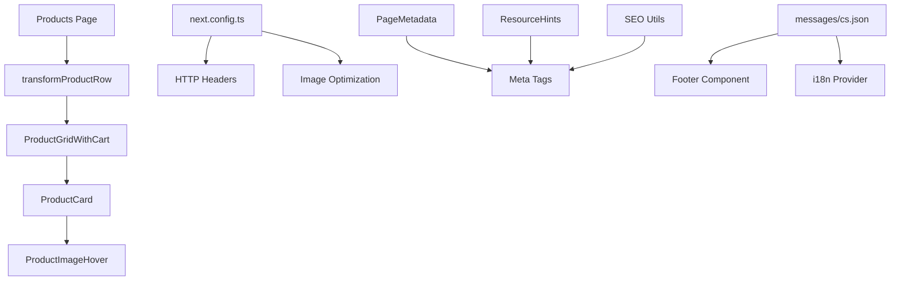

# Design Document

## Overview

This design addresses five critical production issues in the funeral wreaths e-commerce platform. The fixes span product image rendering, component styling, internationalization, and web standards compliance. The solution maintains backward compatibility while modernizing the codebase to align with current best practices.

The design follows the existing architecture patterns:
- Server Components for data fetching (Next.js 15 App Router)
- Utility functions for data transformation
- Centralized configuration management
- Type-safe TypeScript implementations
- Atomic Design component structure

## Architecture

### System Components Affected



### Data Flow

1. **Product Image Rendering Flow**
   - Supabase query fetches products with JSONB `images` column
   - `transformProductRow` parses JSONB data (handles both array and string formats)
   - ProductCard receives transformed product with images array
   - `resolvePrimaryProductImage` utility selects primary/first image
   - ProductImageHover renders image with proper container styling

2. **Configuration Flow**
   - next.config.ts defines HTTP headers and meta tag configurations
   - PageMetadata component generates meta tags for each page
   - ResourceHints component provides performance optimization hints
   - SEO utils provide reusable metadata generation functions

## Components and Interfaces

### 1. Product Image Rendering

#### Component: `transformProductRow` (src/lib/utils/product-transforms.ts)

**Current Implementation:**
- Already handles both array and JSON string formats for `images` column
- Includes try-catch error handling with console logging
- Falls back to empty array on parsing errors

**Design Decision:**
The existing implementation is correct and robust. The issue is likely:
1. Database data is NULL or empty
2. Cache contains stale data without images
3. Image URLs are malformed or inaccessible

**Solution:**
- Add validation to ensure images array is not empty before caching
- Add debug logging to track image data through the pipeline
- Verify database contains valid image data
- Clear Redis cache to remove stale data

#### Component: ProductCard (src/components/product/ProductCard.tsx)

**Current State:**
- Uses `resolvePrimaryProductImage` utility for image selection
- Has primary/secondary image logic for hover effects
- Missing explicit height constraints on image containers

**Required Changes:**
```typescript
// Image container needs explicit height
<div className="relative w-full h-64 overflow-hidden">
  <ProductImageHover
    primaryImage={displayPrimaryImage}
    secondaryImage={secondaryImage}
    productName={productName}
    locale={locale}
  />
</div>
```

**Design Rationale:**
- Explicit height prevents Next.js Image optimization warnings
- Maintains aspect ratio across all viewports
- Enables proper `fill` prop usage in Next.js Image component

### 2. Image Height Styling

#### Affected Components:
- ProductCard (src/components/product/ProductCard.tsx)
- ProductImage (src/components/product/ProductImage.tsx)
- ProductGrid (src/components/product/ProductGrid.tsx)

**Design Pattern:**
```typescript
// Parent container pattern for Next.js Image with fill
<div className="relative w-full h-[height] overflow-hidden">
  <Image
    src={imageUrl}
    alt={altText}
    fill
    className="object-cover"
    sizes="(max-width: 768px) 100vw, (max-width: 1200px) 50vw, 33vw"
  />
</div>
```

**Height Strategy:**
- Grid view: `h-64` (256px) for consistent card heights
- List view: `h-32` (128px) for compact display
- Detail view: `h-96` (384px) or `aspect-[4/3]` for larger display
- Mobile: Responsive heights using Tailwind breakpoints

**CSS Classes to Add:**
- `relative` - Required for absolute positioning of fill images
- `h-[size]` - Explicit height constraint
- `overflow-hidden` - Prevents image overflow
- `aspect-[ratio]` - Alternative to fixed height for responsive design

### 3. Internationalization Completeness

#### File: messages/cs.json

**Current State:**
```json
{
  "contact": {
    "title": "Kontakt",
    // ... other keys
  }
  // Missing footer.home key
}
```

**Required Addition:**
```json
{
  "footer": {
    "home": "Domů",
    "products": "Produkty",
    "about": "O nás",
    "contact": "Kontakt",
    // ... other footer keys
  }
}
```

**Design Decision:**
- Add complete `footer` section to match English locale structure
- Ensure all footer navigation keys are present
- Maintain consistency with existing translation patterns

#### File: messages/en.json

**Verification Required:**
- Ensure `footer.home` exists with value "Home"
- Verify all footer keys match Czech locale structure

### 4. Modern HTML Meta Tag Compliance

#### Affected Files:
- src/components/seo/PageMetadata.tsx (line 97)
- src/components/performance/ResourceHints.tsx (line 83)
- src/lib/seo/utils.ts (line 352)

**Current Implementation:**
```typescript
// Deprecated
"apple-mobile-web-app-capable": "yes"
```

**Updated Implementation:**
```typescript
// Modern standard
"mobile-web-app-capable": "yes"
```

**Design Rationale:**
- `apple-mobile-web-app-capable` is deprecated per HTML standards
- `mobile-web-app-capable` is the modern, vendor-neutral alternative
- Maintains same functionality across all mobile devices
- Removes browser console warnings

**Implementation Strategy:**
1. Update PageMetadata component meta tag generation
2. Update ResourceHints component meta tags
3. Update SEO utils metadata object
4. Verify no other files reference the deprecated tag

### 5. HTTP Headers Policy Modernization

#### File: next.config.ts

**Current Implementation:**
```typescript
{
  key: "Permissions-Policy",
  value: "camera=(), microphone=(), geolocation=(), payment=(self), usb=(), bluetooth=()"
}
```

**Issue:**
The `bluetooth` directive is not supported in the Permissions-Policy specification.

**Updated Implementation:**
```typescript
{
  key: "Permissions-Policy",
  value: "camera=(), microphone=(), geolocation=(), payment=(self), usb=()"
}
```

**Supported Directives (as of 2025):**
- camera
- microphone
- geolocation
- payment
- usb
- accelerometer
- gyroscope
- magnetometer
- fullscreen
- picture-in-picture
- display-capture

**Design Rationale:**
- Remove unsupported `bluetooth` directive to eliminate console warnings
- Maintain all other security restrictions
- Align with current Permissions-Policy specification
- Follow OWASP security best practices

## Data Models

### Product Image Structure

```typescript
interface ProductImage {
  id: string;
  url: string;
  alt: string;
  isPrimary: boolean;
  sortOrder: number;
}

interface Product {
  id: string;
  name: LocalizedContent;
  slug: string;
  images: ProductImage[]; // Parsed from JSONB column
  // ... other fields
}
```

### Translation Structure

```typescript
interface FooterTranslations {
  home: string;
  products: string;
  about: string;
  contact: string;
  legal: string;
  privacy: string;
  terms: string;
  // ... other footer keys
}

interface Messages {
  footer: FooterTranslations;
  // ... other sections
}
```

## Error Handling

### Product Image Parsing

**Error Scenarios:**
1. JSONB column is NULL → Return empty array
2. JSONB parsing fails → Log error, return empty array
3. Parsed data is not an array → Return empty array
4. Image URLs are invalid → Use placeholder image

**Implementation:**
```typescript
try {
  if (Array.isArray(row.images)) {
    images = row.images;
  } else if (typeof row.images === 'string') {
    const parsed = JSON.parse(row.images);
    images = Array.isArray(parsed) ? parsed : [];
  }
} catch (error) {
  console.error('Failed to parse product images:', error);
  images = [];
}
```

### Translation Missing Keys

**Error Scenarios:**
1. Key doesn't exist → next-intl shows warning in console
2. Locale file is malformed → Build fails with clear error
3. Key exists but value is empty → Display empty string

**Prevention:**
- Add all required keys to both locale files
- Use TypeScript for type-safe translation keys
- Validate translation files in CI/CD pipeline

### Image Height Warnings

**Error Scenarios:**
1. Parent container has no height → Next.js warning in console
2. Image uses `fill` without `relative` parent → Layout issues
3. Aspect ratio not maintained → Image distortion

**Prevention:**
- Always use explicit height or aspect-ratio on parent containers
- Ensure parent has `position: relative` for `fill` images
- Use `object-cover` or `object-contain` for proper scaling

## Testing Strategy

### 1. Product Image Rendering Tests

**Manual Testing:**
1. Clear Redis cache: `redis-cli FLUSHALL`
2. Verify database has image data: Query `products` table
3. Load products page and check browser console for debug logs
4. Verify images display correctly in ProductCard components
5. Test primary image selection logic
6. Test fallback to first image when no primary exists
7. Test placeholder display when no images exist

**Automated Testing:**
```typescript
describe('transformProductRow', () => {
  it('should parse images from array format', () => {
    const row = { images: [{ url: 'test.jpg', isPrimary: true }] };
    const product = transformProductRow(row);
    expect(product.images).toHaveLength(1);
  });

  it('should parse images from JSON string format', () => {
    const row = { images: '[{"url":"test.jpg","isPrimary":true}]' };
    const product = transformProductRow(row);
    expect(product.images).toHaveLength(1);
  });

  it('should return empty array on parsing error', () => {
    const row = { images: 'invalid json' };
    const product = transformProductRow(row);
    expect(product.images).toEqual([]);
  });
});
```

### 2. Image Height Styling Tests

**Visual Regression Testing:**
1. Take screenshots of ProductCard in grid view
2. Take screenshots of ProductCard in list view
3. Compare before/after to ensure no layout shifts
4. Test on multiple viewport sizes (mobile, tablet, desktop)

**Console Warning Tests:**
1. Run `npm run build` and check for image warnings
2. Run `npm run dev` and check browser console
3. Verify no "Image with src has either width/height or fill" warnings

### 3. Translation Tests

**Manual Testing:**
1. Switch to Czech locale
2. Navigate to footer
3. Verify "Home" link displays "Domů"
4. Check browser console for missing translation warnings

**Automated Testing:**
```typescript
describe('Footer translations', () => {
  it('should have footer.home key in Czech locale', () => {
    const messages = require('../../messages/cs.json');
    expect(messages.footer.home).toBeDefined();
    expect(messages.footer.home).toBe('Domů');
  });

  it('should have footer.home key in English locale', () => {
    const messages = require('../../messages/en.json');
    expect(messages.footer.home).toBeDefined();
    expect(messages.footer.home).toBe('Home');
  });
});
```

### 4. Meta Tag Tests

**Manual Testing:**
1. View page source in browser
2. Search for "apple-mobile-web-app-capable"
3. Verify it's replaced with "mobile-web-app-capable"
4. Check browser console for deprecation warnings

**Automated Testing:**
```typescript
describe('PageMetadata', () => {
  it('should not include deprecated apple-mobile-web-app-capable', () => {
    const metadata = generateMetadata();
    expect(metadata).not.toContain('apple-mobile-web-app-capable');
  });

  it('should include modern mobile-web-app-capable', () => {
    const metadata = generateMetadata();
    expect(metadata).toContain('mobile-web-app-capable');
  });
});
```

### 5. HTTP Headers Tests

**Manual Testing:**
1. Open browser DevTools Network tab
2. Inspect response headers for any page
3. Verify Permissions-Policy header doesn't include "bluetooth"
4. Check browser console for policy warnings

**Automated Testing:**
```typescript
describe('next.config.ts headers', () => {
  it('should not include bluetooth in Permissions-Policy', () => {
    const config = require('../../next.config.ts');
    const headers = config.headers();
    const permissionsPolicy = headers.find(h => 
      h.headers.some(header => header.key === 'Permissions-Policy')
    );
    expect(permissionsPolicy.headers[0].value).not.toContain('bluetooth');
  });
});
```

## Performance Considerations

### Image Optimization
- Next.js Image component handles automatic optimization
- AVIF and WebP formats reduce file size by 30-50%
- Lazy loading prevents unnecessary network requests
- Proper sizing prevents downloading oversized images

### Caching Strategy
- Redis cache for product data (30 minutes TTL)
- Browser cache for static images (1 year)
- ISR revalidation for product pages (30 minutes)
- Clear cache after database updates

### Bundle Size Impact
- Translation file additions: ~100 bytes
- Meta tag changes: No impact (same size)
- HTTP header changes: -10 bytes (removed "bluetooth")
- Image styling changes: No impact (Tailwind classes)

## Security Considerations

### Permissions-Policy
- Removing "bluetooth" doesn't reduce security
- All other restrictive policies remain in place
- Follows principle of least privilege
- Aligns with OWASP recommendations

### Image URLs
- Validate image URLs before rendering
- Use Content Security Policy to restrict image sources
- Sanitize alt text to prevent XSS
- Use Supabase signed URLs for private images

### Translation Injection
- next-intl automatically escapes translation values
- No user input in translation keys
- Static JSON files prevent injection attacks

## Accessibility Considerations

### Image Alt Text
- All images must have descriptive alt text
- Use product name and description for context
- Support screen readers with meaningful descriptions
- Fallback to generic text if product name unavailable

### Semantic HTML
- Use `<article>` for ProductCard components
- Use `<nav>` for footer navigation
- Maintain proper heading hierarchy
- Ensure keyboard navigation works correctly

### Color Contrast
- Maintain WCAG AA compliance (4.5:1 ratio)
- Test with accessibility tools
- Ensure text is readable on all backgrounds

## Migration Strategy

### Phase 1: Image Height Fixes (Low Risk)
1. Update ProductCard component with explicit heights
2. Update ProductImage component styling
3. Update ProductGrid component layout
4. Test on development environment
5. Deploy to staging for QA testing
6. Deploy to production

### Phase 2: Translation Updates (Low Risk)
1. Add missing keys to messages/cs.json
2. Verify keys exist in messages/en.json
3. Test in development with both locales
4. Deploy to staging for QA testing
5. Deploy to production

### Phase 3: Meta Tag Updates (Low Risk)
1. Update PageMetadata component
2. Update ResourceHints component
3. Update SEO utils
4. Test in development
5. Deploy to staging for QA testing
6. Deploy to production

### Phase 4: HTTP Headers Update (Low Risk)
1. Update next.config.ts
2. Test in development
3. Verify no console warnings
4. Deploy to staging for QA testing
5. Deploy to production

### Phase 5: Product Image Debugging (Medium Risk)
1. Add debug logging to products page
2. Clear Redis cache
3. Verify database data
4. Test image rendering
5. Remove debug logging after verification
6. Deploy to production

### Rollback Plan
- All changes are backward compatible
- Can revert individual commits if issues arise
- Redis cache can be cleared to reset state
- No database schema changes required

## Monitoring and Validation

### Success Metrics
1. Zero image height warnings in build logs
2. Zero missing translation warnings in console
3. Zero deprecated meta tag warnings
4. Zero Permissions-Policy warnings
5. Product images display correctly on all pages

### Monitoring Tools
- Browser DevTools Console
- Next.js build output
- Lighthouse performance audits
- Sentry error tracking
- Google Analytics for user impact

### Validation Checklist
- [ ] All ProductCard images have explicit heights
- [ ] No Next.js Image optimization warnings
- [ ] Footer displays "Domů" in Czech locale
- [ ] No missing translation key warnings
- [ ] Meta tags use "mobile-web-app-capable"
- [ ] No deprecated meta tag warnings
- [ ] Permissions-Policy excludes "bluetooth"
- [ ] No HTTP header warnings in console
- [ ] Product images render correctly
- [ ] Primary image selection works
- [ ] Fallback to first image works
- [ ] Placeholder displays when no images exist
