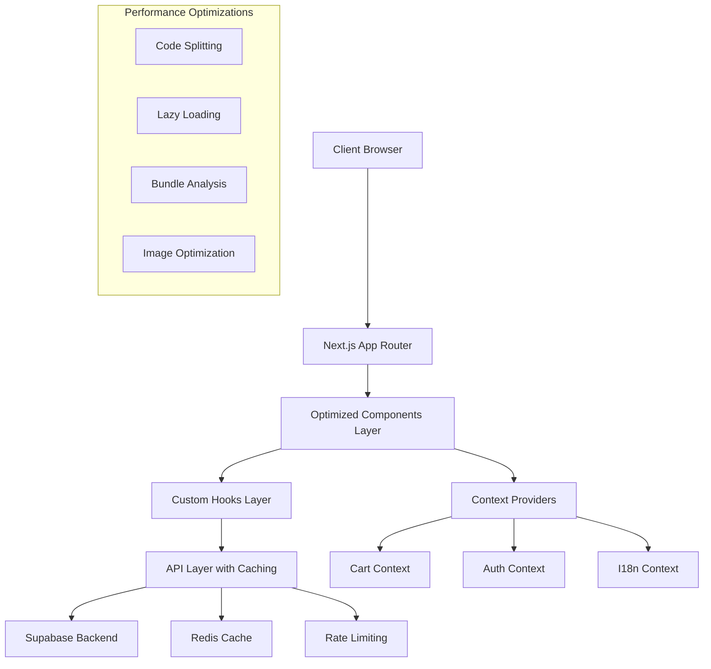

# Design Document - Refactor Optimization

## Overview

This design document outlines the comprehensive refactoring and optimization strategy for the funeral wreaths e-commerce application. The current system is a Next.js 15 application with TypeScript, Supabase backend, and internationalization support that requires both technical optimization and critical functional fixes.

The refactoring addresses two complementary areas:

1. **Technical Optimization** (Requirements 1-6): Code structure, performance, bundle optimization, component architecture, API efficiency, build optimization, and testing enhancement
2. **Functional Fixes** (Requirements 1-7): Critical functionality repairs including EN/CZ translations, cart logic, professional UI/UX design, homepage product teasers, navigation simplification, GDPR compliance pages, and responsive design

This dual approach ensures both improved developer experience and enhanced user experience while maintaining the respectful, professional tone appropriate for funeral wreath commerce.

## Architecture

### Current Architecture Analysis

The application currently uses:

- **Frontend**: Next.js 15 with App Router, TypeScript, Tailwind CSS, next-intl for internationalization
- **Backend**: Supabase PostgreSQL with API routes and RLS policies
- **Caching**: Redis (Upstash) with fallback to in-memory cache
- **Authentication**: NextAuth.js integration with Supabase
- **State Management**: React Context with useReducer for cart functionality
- **Performance**: ISR, SSG, and image optimization already implemented
- **Styling**: Tailwind CSS with design system approach
- **Quality**: Biome for linting and formatting

### Current Issues Identified

**Technical Debt**:

- Bundle size optimization needed (20%+ reduction required)
- Component architecture needs atomic design principles
- API calls lack proper caching and error handling
- Build configuration requires production optimization
- Test coverage needs enhancement

**Functional Issues**:

- EN/CZ translation system has broken language switching
- Cart functionality shows incorrect real-time updates
- UI/UX lacks professional funeral-appropriate design
- Homepage missing product teasers
- Navigation contains non-functional elements
- Missing GDPR and legal compliance pages
- Responsive design inconsistencies across devices

### Target Architecture



## Internationalization and Functional Design

### Translation System Architecture

**Current Issue**: EN/CZ language switching is broken and translations are incomplete.

**Design Solution**:

```typescript
// Enhanced i18n configuration with fallback handling
interface I18nConfig {
  defaultLocale: 'cs';
  locales: ['cs', 'en'];
  fallbackLocale: 'cs';
  namespaces: ['common', 'products', 'cart', 'legal'];
}

// Translation hook with error handling
interface UseTranslationReturn {
  t: (key: string, params?: Record<string, any>) => string;
  locale: string;
  setLocale: (locale: string) => void;
  isLoading: boolean;
  error: string | null;
}
```

**Implementation Strategy**:

- Implement proper next-intl configuration with fallback mechanisms
- Create comprehensive translation files for all UI elements
- Add language persistence across sessions
- Implement graceful fallback for missing translations

### Cart System Redesign

**Current Issue**: Cart updates don't reflect immediately and persistence is unreliable.

**Design Solution**:

```typescript
// Enhanced cart context with optimistic updates
interface CartContextValue {
  items: CartItem[];
  addItem: (product: Product) => Promise<void>;
  removeItem: (itemId: string) => Promise<void>;
  updateQuantity: (itemId: string, quantity: number) => Promise<void>;
  clearCart: () => Promise<void>;
  total: number;
  itemCount: number;
  isLoading: boolean;
  error: string | null;
}

// Cart persistence strategy
interface CartPersistence {
  saveToLocal: (cart: Cart) => void;
  loadFromLocal: () => Cart | null;
  syncWithServer: (cart: Cart) => Promise<Cart>;
  handleConflicts: (local: Cart, server: Cart) => Cart;
}
```

### UI/UX Design System

**Current Issue**: Unprofessional appearance, poor contrast, inconsistent styling.

**Design Solution**:

```typescript
// Funeral-appropriate design tokens
interface DesignTokens {
  colors: {
    primary: '#2D5016'; // Deep forest green
    secondary: '#8B9467'; // Muted sage
    accent: '#D4AF37'; // Respectful gold
    neutral: {
      50: '#F8F9FA';
      100: '#E9ECEF';
      800: '#343A40';
      900: '#212529';
    };
    semantic: {
      success: '#28A745';
      warning: '#FFC107';
      error: '#DC3545';
      info: '#17A2B8';
    };
  };
  typography: {
    fontFamily: 'Inter, system-ui, sans-serif';
    scale: 'modular scale based on 1.25 ratio';
  };
  spacing: 'consistent 8px grid system';
}
```

### Homepage Product Teasers

**Current Issue**: Homepage lacks product showcase to encourage browsing.

**Design Solution**:

```typescript
// Homepage product teaser component
interface ProductTeaserProps {
  products: Product[];
  locale: string;
  onProductClick: (product: Product) => void;
  onAddToCart: (product: Product) => void;
}

// Random product selection strategy
interface ProductSelectionStrategy {
  selectFeatured: (products: Product[], count: number) => Product[];
  rotateDaily: boolean;
  prioritizeInStock: boolean;
  respectCategories: boolean;
}
```

### Navigation Simplification

**Current Issue**: Navigation contains broken links and non-functional sections.

**Design Solution**:

```typescript
// Simplified navigation structure
interface NavigationItem {
  key: string;
  label: string;
  href: string;
  isActive: boolean;
  isEnabled: boolean;
}

// Navigation configuration
const navigationConfig = {
  primary: [
    { key: 'products', label: 'navigation.allProducts', href: '/products' },
    { key: 'cart', label: 'navigation.cart', href: '/cart' },
  ],
  secondary: [
    { key: 'about', label: 'navigation.about', href: '/about' },
    { key: 'contact', label: 'navigation.contact', href: '/contact' },
  ],
  legal: [
    { key: 'gdpr', label: 'legal.gdpr', href: '/legal/gdpr' },
    { key: 'terms', label: 'legal.terms', href: '/legal/terms' },
    { key: 'privacy', label: 'legal.privacy', href: '/legal/privacy' },
    { key: 'cookies', label: 'legal.cookies', href: '/legal/cookies' },
  ],
};
```

### Legal and GDPR Compliance

**Current Issue**: Missing legal pages causing 404 errors and compliance concerns.

**Design Solution**:

```typescript
// Legal page structure
interface LegalPageProps {
  locale: string;
  pageType: 'gdpr' | 'terms' | 'privacy' | 'cookies';
  lastUpdated: Date;
}

// GDPR compliance features
interface GDPRFeatures {
  consentManager: ConsentManagerProps;
  dataExport: DataExportProps;
  dataDeletion: DataDeletionProps;
  cookiePreferences: CookiePreferencesProps;
}
```

### Responsive Design System

**Current Issue**: Inconsistent behavior across devices and browsers.

**Design Solution**:

```typescript
// Responsive breakpoint system
interface ResponsiveBreakpoints {
  mobile: '320px - 767px';
  tablet: '768px - 1023px';
  desktop: '1024px - 1439px';
  wide: '1440px+';
}

// Component responsive behavior
interface ResponsiveComponent {
  mobile: ComponentVariant;
  tablet: ComponentVariant;
  desktop: ComponentVariant;
  adaptiveImages: boolean;
  touchOptimized: boolean;
}
```

## Components and Interfaces

### Component Architecture Redesign

Based on atomic design principles and Byterover memory insights:

#### 1. Atomic Components (Redesigned)

```typescript
// Enhanced Button component with performance optimizations
interface ButtonProps {
  variant: 'primary' | 'secondary' | 'ghost';
  size: 'sm' | 'md' | 'lg';
  loading?: boolean;
  disabled?: boolean;
  onClick?: () => void;
  children: React.ReactNode;
}

// Optimized Input with proper validation
interface InputProps {
  type: string;
  value: string;
  onChange: (value: string) => void;
  validation?: ValidationRule[];
  error?: string;
}
```

#### 2. Molecular Components (Optimized)

```typescript
// Enhanced ProductCard with lazy loading and performance
interface ProductCardProps {
  product: Product;
  onAddToCart: (product: Product) => void;
  locale: string;
  currency: string;
  lazy?: boolean;
}

// Optimized CartIcon with real-time updates
interface CartIconProps {
  itemCount: number;
  isLoading: boolean;
  onClick: () => void;
}
```

#### 3. Organism Components (Refactored)

```typescript
// Redesigned ProductGrid with virtualization
interface ProductGridProps {
  products: Product[];
  loading: boolean;
  onLoadMore?: () => void;
  filters?: ProductFilters;
  virtualizeThreshold?: number;
}

// Enhanced Navigation with performance optimizations
interface NavigationProps {
  locale: string;
  user?: User;
  cartCount: number;
}
```

### Custom Hooks Architecture

#### Performance-Optimized Hooks

```typescript
// Enhanced cart hook with optimistic updates
interface UseCartReturn {
  items: CartItem[];
  addItem: (product: Product) => Promise<void>;
  removeItem: (itemId: string) => Promise<void>;
  updateQuantity: (itemId: string, quantity: number) => Promise<void>;
  total: number;
  isLoading: boolean;
  error: string | null;
}

// Optimized API hook with caching
interface UseApiReturn<T> {
  data: T | null;
  loading: boolean;
  error: Error | null;
  refetch: () => Promise<void>;
  mutate: (data: T) => void;
}
```

## Data Models

### Enhanced Type Definitions

According to Byterover memory layer, the current system uses JSONB for cart storage and proper TypeScript definitions. The refactored models will enhance these:

```typescript
// Enhanced Product model with SEO and performance fields
interface Product {
  id: string;
  name: Record<string, string>; // Multilingual support
  description: Record<string, string>;
  price: number;
  currency: string;
  images: OptimizedImage[];
  category: Category;
  inventory: InventoryInfo;
  seo: SEOMetadata;
  createdAt: Date;
  updatedAt: Date;
}

// Optimized Cart model with performance tracking
interface Cart {
  id: string;
  userId?: string;
  sessionId: string;
  items: CartItem[];
  total: number;
  currency: string;
  lastUpdated: Date;
  expiresAt: Date;
}

// Enhanced User model with preferences
interface User {
  id: string;
  email: string;
  preferences: UserPreferences;
  addresses: Address[];
  orderHistory: Order[];
}
```

## Error Handling

### Comprehensive Error Management Strategy

Based on Byterover memory extracted patterns, the system will implement:

#### 1. Error Boundary Architecture

```typescript
// Enhanced Error Boundary with recovery mechanisms
interface ErrorBoundaryState {
  hasError: boolean;
  error: Error | null;
  errorInfo: ErrorInfo | null;
  retryCount: number;
}

// API Error Handling with retry logic
interface ApiErrorHandler {
  handleError: (error: ApiError) => void;
  retry: (operation: () => Promise<any>) => Promise<any>;
  fallback: (error: Error) => any;
}
```

#### 2. Error Categories and Responses

- **Network Errors**: Automatic retry with exponential backoff
- **Validation Errors**: User-friendly messages with field highlighting
- **Authentication Errors**: Redirect to login with return URL
- **Server Errors**: Graceful degradation with offline capabilities
- **Translation Errors**: Fallback to default language

#### 3. Monitoring Integration

From Byterover memory tools, the system already has error logging. Enhanced monitoring will include:

- Performance metrics tracking
- User journey error mapping
- Real-time error alerting
- Error recovery success rates

## Testing Strategy

### Multi-Layer Testing Approach

#### 1. Unit Testing (Enhanced)

```typescript
// Component testing with performance validation
describe('ProductCard', () => {
  it('should render without performance issues', async () => {
    const { container } = render(<ProductCard {...mockProps} />);

    // Performance assertion
    expect(container.firstChild).toBeInTheDocument();

    // Accessibility testing
    const results = await axe(container);
    expect(results).toHaveNoViolations();
  });
});

// Hook testing with state management
describe('useCart', () => {
  it('should handle optimistic updates correctly', async () => {
    const { result } = renderHook(() => useCart());

    act(() => {
      result.current.addItem(mockProduct);
    });

    expect(result.current.items).toContain(mockProduct);
  });
});
```

#### 2. Integration Testing (Expanded)

- **API Integration**: Test all API routes with caching scenarios
- **Database Integration**: Test Supabase operations with real data
- **Authentication Flow**: Test NextAuth.js integration
- **Internationalization**: Test language switching and translations
- **Cart Persistence**: Test cart state across sessions

#### 3. E2E Testing (Performance-Focused)

```typescript
// Enhanced E2E tests with performance metrics
test('complete purchase flow with performance tracking', async ({ page }) => {
  // Start performance monitoring
  await page.coverage.startJSCoverage();

  // Test user journey
  await page.goto('/products');
  await page.click('[data-testid="add-to-cart"]');
  await page.goto('/cart');
  await page.click('[data-testid="checkout"]');

  // Validate performance
  const coverage = await page.coverage.stopJSCoverage();
  const bundleSize = coverage.reduce((acc, entry) => acc + entry.text.length, 0);
  expect(bundleSize).toBeLessThan(500000); // 500KB limit
});
```

#### 4. Performance Testing

- **Bundle Size Analysis**: Automated bundle size regression testing
- **Core Web Vitals**: LCP, FID, CLS monitoring in tests
- **Memory Leak Detection**: Component unmounting and cleanup testing
- **Cache Effectiveness**: Redis cache hit rate validation

## Implementation Phases

### Phase 1: Foundation and Architecture (Technical Requirements 1, 3)

**Focus**: Code structure, component architecture, TypeScript improvements

**Key Deliverables**:

- Refactored component hierarchy with atomic design principles
- Enhanced TypeScript definitions with strict mode enabled
- Improved custom hooks with performance optimizations
- Barrel exports and tree-shaking setup
- Component library with consistent interfaces

**Requirements Addressed**: Technical Req 1 (code structure), Technical Req 3 (component architecture)

### Phase 2: Performance and Bundle Optimization (Technical Requirements 2, 4)

**Focus**: Bundle optimization, API efficiency, caching improvements

**Key Deliverables**:

- Code splitting and lazy loading implementation (20%+ bundle reduction)
- Enhanced caching strategies with Redis optimization
- Image optimization and lazy loading
- API call optimization with React Query/SWR integration
- Performance monitoring and Core Web Vitals tracking

**Requirements Addressed**: Technical Req 2 (performance), Technical Req 4 (API optimization)

### Phase 3: Critical Functional Fixes (Functional Requirements 1-4)

**Focus**: Translation system, cart functionality, UI/UX, homepage features

**Key Deliverables**:

- Fixed EN/CZ translation system with proper fallbacks
- Corrected cart functionality with real-time updates and persistence
- Professional UI/UX with funeral-appropriate design system
- Homepage product teasers with random rotation
- Responsive design implementation across all devices

**Requirements Addressed**: Functional Req 1 (i18n), Req 2 (cart), Req 3 (UI/UX), Req 4 (homepage), Req 7 (responsive)

### Phase 4: Navigation and Compliance (Functional Requirements 5-6)

**Focus**: Navigation simplification, legal pages, GDPR compliance

**Key Deliverables**:

- Simplified navigation with only functional elements
- Complete GDPR compliance pages with proper content
- Terms & Conditions, Privacy Policy, and Cookies pages
- Legal page templates ready for content integration
- Footer and navigation link corrections

**Requirements Addressed**: Functional Req 5 (navigation), Req 6 (legal/GDPR)

### Phase 5: Build Optimization and Quality (Technical Requirements 5-6)

**Focus**: Production optimization, testing enhancement, deployment efficiency

**Key Deliverables**:

- Optimized Next.js configuration for production
- Dependency analysis and cleanup
- Environment-specific optimizations
- Enhanced test coverage across all layers
- Performance regression testing
- Automated quality checks and CI/CD pipeline optimization

**Requirements Addressed**: Technical Req 5 (build optimization), Technical Req 6 (testing)

## Design Decisions and Rationales

### 1. Component Architecture Choice

**Decision**: Atomic Design with Performance-First Approach
**Rationale**: The current component structure needs better organization for maintainability (Technical Req 1, 3). Atomic design provides clear hierarchy while performance-first approach ensures optimal rendering and 20%+ bundle reduction (Technical Req 2).

### 2. State Management Strategy

**Decision**: Enhanced React Context with Optimistic Updates
**Rationale**: The cart already uses Context + useReducer but lacks real-time updates (Functional Req 2). Enhancement will focus on optimistic updates, preventing unnecessary re-renders, and proper persistence across sessions.

### 3. Internationalization Architecture

**Decision**: Enhanced next-intl with Comprehensive Fallback System
**Rationale**: Current EN/CZ translation system is broken (Functional Req 1). The enhanced system will provide proper language switching, session persistence, and graceful fallbacks for missing translations while maintaining SEO benefits.

### 4. UI/UX Design System

**Decision**: Funeral-Appropriate Design Tokens with Professional Styling
**Rationale**: Current UI lacks professional appearance suitable for funeral commerce (Functional Req 3). New design system uses respectful colors (deep greens, muted tones), proper contrast ratios, and empathetic typography to build trust and credibility.

### 5. Bundle Optimization Approach

**Decision**: Aggressive Code Splitting with Route-Based Chunks
**Rationale**: Next.js 15 provides excellent code splitting capabilities (Technical Req 2). Implementation will focus on reducing initial bundle size by 20%+ through dynamic imports, tree-shaking, and dependency optimization.

### 6. Caching Strategy

**Decision**: Multi-Layer Caching with Redis Primary and API Optimization
**Rationale**: Redis caching is already implemented but needs enhancement (Technical Req 4). Multi-layer approach will add intelligent cache invalidation, API call optimization with React Query, and proper error handling with retry mechanisms.

### 7. Navigation Simplification

**Decision**: Minimal Functional Navigation with Clear Hierarchy
**Rationale**: Current navigation contains broken links and non-functional elements (Functional Req 5). Simplified approach focuses only on working features while maintaining clear user paths and professional appearance.

### 8. Legal Compliance Strategy

**Decision**: Comprehensive GDPR Pages with Template-Based Content
**Rationale**: Missing legal pages cause 404 errors and compliance issues (Functional Req 6). Template-based approach allows quick deployment with placeholder content while providing structure for legal team to add proper content.

### 9. Responsive Design Approach

**Decision**: Mobile-First Design with Consistent Breakpoints
**Rationale**: Current responsive behavior is inconsistent across devices (Functional Req 7). Mobile-first approach ensures optimal experience on all devices with consistent breakpoints and touch-optimized interactions.

### 10. Testing Strategy Selection

**Decision**: Comprehensive Multi-Layer Testing with Performance Gates
**Rationale**: Current testing needs expansion to prevent regressions during refactoring (Technical Req 6). Strategy focuses on maintaining functionality while ensuring performance standards and accessibility compliance.

## Success Criteria and Validation

### Technical Optimization Validation

- **Bundle Size**: Achieve 20%+ reduction in initial bundle size
- **Performance**: Improve Core Web Vitals scores (LCP, FID, CLS)
- **Code Quality**: Reduce technical debt and improve maintainability scores
- **API Efficiency**: Implement proper caching with measurable hit rates
- **Build Optimization**: Faster build times and optimized production assets
- **Test Coverage**: Maintain or improve existing test coverage while adding new tests

### Functional Fixes Validation

- **Internationalization**: Seamless EN/CZ language switching with session persistence
- **Cart Functionality**: Real-time updates with proper persistence across sessions
- **UI/UX Quality**: Professional, respectful design appropriate for funeral commerce
- **Homepage Features**: Working product teasers with random rotation
- **Navigation**: Clean, functional navigation without broken links
- **Legal Compliance**: All GDPR and legal pages accessible without 404 errors
- **Responsive Design**: Consistent behavior across all devices and browsers

### User Experience Metrics

- **Page Load Speed**: Improved loading times across all pages
- **Conversion Rate**: Better user engagement through professional design
- **Error Reduction**: Fewer 404 errors and broken functionality
- **Accessibility**: WCAG 2.1 AA compliance maintained
- **Trust Indicators**: Professional appearance building customer confidence

This comprehensive design addresses all 13 requirements (6 technical + 7 functional) while maintaining the existing functionality and ensuring a professional, empathetic user experience appropriate for funeral wreath commerce. The phased approach allows for incremental improvements with validation at each stage.
