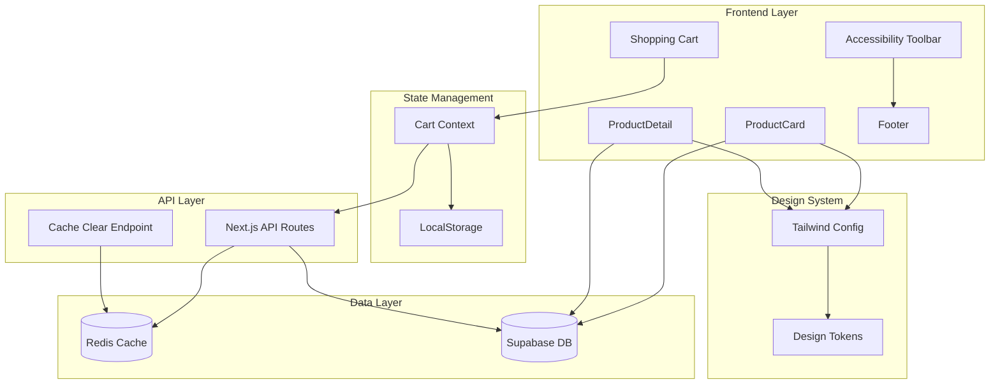

# Design Document

## Overview

This design document outlines the technical approach for resolving critical bugs and implementing improvements across the funeral wreaths e-commerce platform. The solution addresses seven distinct issues spanning product image rendering, cart state management, internationalization, accessibility UX, and design system modernization.

### Design Goals

1. **Reliability**: Ensure product images display consistently across all components
2. **Data Consistency**: Maintain synchronization between LocalStorage, Redis cache, and Supabase database
3. **Maintainability**: Migrate to Tailwind CSS 4 best practices with centralized color system
4. **User Experience**: Improve accessibility toolbar placement and ensure complete translations
5. **Visual Quality**: Maintain professional aesthetics with proper image optimization and corner cropping

### Key Principles

- **Single Source of Truth**: Supabase database is authoritative for product data
- **Progressive Enhancement**: Graceful degradation when images fail to load
- **Cache Consistency**: Explicit cache clearing with verification
- **Semantic Naming**: Use design tokens and semantic color names
- **Mobile-First**: Responsive design with mobile-specific considerations

## Architecture

### System Components



### Data Flow

1. **Product Image Loading**:

   - Component requests product data from Supabase
   - Primary image identified by `isPrimary` flag
   - Fallback to first image if no primary
   - Placeholder displayed if no images exist

2. **Cart Operations**:

   - User action triggers cart context update
   - LocalStorage updated immediately (optimistic)
   - API call updates database
   - Redis cache cleared explicitly
   - Cart state refreshed from database

3. **Color System**:
   - Tailwind config defines CSS custom properties
   - Components reference semantic color names
   - Gradient applied at root level
   - Cards/containers use teal-900 background

## Components and Interfaces

### 1. Product Image Display System

#### ProductCardLayout Component

**Current Issue**: Images not rendering despite data in Supabase

**Design Solution**:

```typescript
interface ProductCardLayoutProps {
  product: Product;
  className?: string;
}

interface Product {
  id: string;
  name: string;
  slug: string;
  images: ProductImage[];
  // ... other fields
}

interface ProductImage {
  id: string;
  url: string;
  isPrimary: boolean;
  altText: string;
  displayOrder: number;
}
```

**Image Resolution Logic**:

```typescript
function resolveProductImage(product: Product): string {
  // 1. Try primary image
  const primaryImage = product.images?.find((img) => img.isPrimary);
  if (primaryImage?.url) return primaryImage.url;

  // 2. Fallback to first image
  const firstImage = product.images?.[0];
  if (firstImage?.url) return firstImage.url;

  // 3. Fallback to placeholder
  return "/images/placeholder-wreath.jpg";
}
```

**Corner Cropping Integration**:

- Use CSS `clip-path` for corner cropping
- Apply to container, not image element
- Ensure z-index layering: image (z-0) → overlay (z-10)
- Maintain aspect ratio with `object-cover`

#### ProductDetail Component

**Current Issue**: Images merged together, not in clean layout

**Design Solution**:

```typescript
interface ProductDetailImageGridProps {
  images: ProductImage[];
  productName: string;
}
```

**Layout Strategy**:

- **Desktop**: CSS Grid with 2 columns, auto rows
- **Tablet**: CSS Grid with 2 columns, smaller gaps
- **Mobile**: Single column stack

**Grid Configuration**:

```css
.product-image-grid {
  display: grid;
  grid-template-columns: repeat(auto-fill, minmax(250px, 1fr));
  gap: 1rem;
  max-height: calc(100vh - 200px); /* Match right column */
  overflow-y: auto;
}
```

**Image Optimization**:

- Use Next.js `<Image>` component
- Quality: 70 (already configured in next.config.ts)
- Sizes: `(max-width: 768px) 100vw, (max-width: 1200px) 50vw, 33vw`
- Priority: First image only
- Loading: Lazy for subsequent images

### 2. Shopping Cart State Management

#### Current Issue Analysis

**Problem**: Last item persists in cart after deletion
**Root Cause**: Redis cache not fully cleared when cart becomes empty

**Cache Keys Involved**:

```typescript
const CACHE_KEYS = {
  cartConfig: `cart:config:${userId || sessionId}`,
  priceCalculation: `cart:price:${productId}:${customizationHash}`,
  priceTracking: `cart:price-keys:${userId || sessionId}`,
};
```

#### Enhanced Cart Context Design

**State Flow**:

```typescript
interface CartState {
  items: CartItem[];
  isLoading: boolean;
  error: string | null;
}

interface CartItem {
  id: string;
  productId: string;
  quantity: number;
  customization: ProductCustomization;
  price: number;
}
```

**Remove Item Logic**:

```type
sync function removeItem(itemId: string) {
  // 1. Optimistic update
  const remainingItems = state.items.filter(item => item.id !== itemId);
  setState({ ...state, items: remainingItems });

  // 2. Update LocalStorage
  localStorage.setItem('cart', JSON.stringify(remainingItems));

  // 3. Call DELETE API
  await fetch(`/api/cart/items/${itemId}`, { method: 'DELETE' });

  // 4. If cart is now empty, explicitly clear cache
  if (remainingItems.length === 0) {
    await fetch('/api/cart/clear-cache', {
      method: 'POST',
      credentials: 'include'
    });

    // Clear LocalStorage completely
    localStorage.removeItem('cart');
  }

  // 5. Refresh cart from database
  await fetchCart();
}
```

**Clear All Logic**:

```typescript
async function clearCart() {
  // 1. Optimistic update
  setState({ ...state, items: [] });

  // 2. Clear LocalStorage
  localStorage.removeItem("cart");

  // 3. Call DELETE all API
  await fetch("/api/cart/clear", { method: "DELETE" });

  // 4. Explicitly clear cache
  await fetch("/api/cart/clear-cache", {
    method: "POST",
    credentials: "include",
  });

  // 5. Verify empty state
  await fetchCart();
}
```

#### Cache Clear API Endpoint

**Endpoint**: `POST /api/cart/clear-cache`

**Implementation**:

```typescript
export async function POST(request: Request) {
  try {
    const session = await getSession();
    const userId = session?.user?.id;
    const sessionId = request.cookies.get("session_id")?.value;

    if (!userId && !sessionId) {
      return NextResponse.json({ error: "No session found" }, { status: 401 });
    }

    // Clear all cart-related cache
    await forceClearCartCache(userId || sessionId);

    // Verify cache is cleared
    const cacheState = await debugCacheState(userId || sessionId);

    return NextResponse.json({
      success: true,
      cacheState,
    });
  } catch (error) {
    logErrorWithContext(error, { endpoint: "clear-cache" });
    return NextResponse.json({ error: "Cache clear failed" }, { status: 500 });
  }
}
```

**Cache Clearing Utility**:

```typescript
async function forceClearCartCache(identifier: string) {
  const redis = getRedisClient();

  // 1. Clear cart config
  await redis.del(`cart:config:${identifier}`);

  // 2. Get all price calculation keys
  const priceKeys = await redis.smembers(`cart:price-keys:${identifier}`);

  // 3. Delete all price calculations
  if (priceKeys.length > 0) {
    await redis.del(...priceKeys);
  }

  // 4. Clear price tracking set
  await redis.del(`cart:price-keys:${identifier}`);

  // 5. Log operation
  console.log(`[Cache] Cleared all cart cache for ${identifier}`);
}
```

### 3. Internationalization System

#### Missing Translations

**Files to Update**:

- `messages/cs.json`
- `messages/en.json`

**New Translation Keys**:

```json
{
  "accessibility": {
    "toolbar": {
      "title": "Accessibility Options",
      "footerLink": "Accessibility"
    }
  },
  "cart": {
    "clearAll": "Clear All",
    "clearAllConfirm": "Are you sure you want to remove all items?"
  }
}
```

**Czech Translations**:

```json
{
  "accessibility": {
    "toolbar": {
      "title": "Možnosti přístupnosti",
      "footerLink": "Přístupnost"
    }
  },
  "cart": {
    "clearAll": "Vymazat vše",
    "clearAllConfirm": "Opravdu chcete odstranit všechny položky?"
  }
}
```

**Component Integration**:

```typescript
import { useTranslations } from "next-intl";

function ShoppingCart() {
  const t = useTranslations("cart");

  return <button onClick={handleClearAll}>{t("clearAll")}</button>;
}
```

### 4. Accessibility Toolbar Redesign

#### Current State

- Button visible in header at `top-4`
- Always visible, clutters interface

#### New Design

**Footer Link**:

```typescript
// src/components/layout/Footer.tsx
function Footer() {
  const t = useTranslations("accessibility");

  const handleAccessibilityClick = () => {
    // Scroll to top
    window.scrollTo({ top: 0, behavior: "smooth" });

    // Find and focus toolbar button
    const toolbarButton = document.querySelector(
      '[aria-controls="accessibility-panel"]'
    );
    if (toolbarButton) {
      (toolbarButton as HTMLElement).focus();
      (toolbarButton as HTMLElement).click();
    }
  };

  return (
    <footer>
      {/* Desktop only */}
      <div className="hidden md:block">
        <button onClick={handleAccessibilityClick}>
          {t("toolbar.footerLink")}
        </button>
      </div>
    </footer>
  );
}
```

**Toolbar Component Changes**:

```typescript
// src/components/accessibility/AccessibilityToolbar.tsx
function AccessibilityToolbar() {
  const [isOpen, setIsOpen] = useState(false);

  return (
    <>
      {/* Button - hidden by default, shown when focused */}
      <button
        aria-controls="accessibility-panel"
        className="fixed top-20 right-4 z-40 opacity-0 focus:opacity-100"
        onClick={() => setIsOpen(!isOpen)}
      >
        {/* Icon */}
      </button>

      {/* Panel */}
      {isOpen && (
        <div
          id="accessibility-panel"
          className="fixed top-24 right-4 z-40 w-80 max-w-[calc(100vw-2rem)] rounded-lg shadow-elegant pt-16"
        >
          {/* Toolbar content */}
        </div>
      )}
    </>
  );
}
```

**Mobile Behavior**:

- Footer link hidden on mobile (`hidden md:block`)
- Toolbar button remains accessible via keyboard navigation
- No visual clutter on small screens

### 5. Tailwind CSS 4 Migration

#### Current State Analysis

**Problem**: Using Tailwind v3 `extend.colors` pattern
**Goal**: Migrate to Tailwind v4 `@theme` directive with CSS custom properties

#### New Configuration Structure

**File**: `tailwind.config.ts`

**Remove**:

```typescript
// OLD - Tailwind v3 style
theme: {
  extend: {
    colors: {
      primary: {
        DEFAULT: "#134e4a";
      }
    }
  }
}
```

**Add**:

```typescript
// NEW - Tailwind v4 style
// Colors defined in CSS file using @theme directive
```

**File**: `src/app/globals.css`

**Add**:

```css
@theme {
  /* Primary color palette (teal) */
  --color-primary: #134e4a;
  --color-primary-light: #2dd4bf;
  --color-primary-dark: #115e59;

  /* Accent color palette (amber) */
  --color-accent: #fef3c7;
  --color-accent-light: #fde68a;

  /* Semantic colors */
  --color-teal-900: #134e4a;
  --color-teal-800: #115e59;
  --color-teal-400: #2dd4bf;
  --color-amber-100: #fef3c7;
  --color-amber-200: #fde68a;
}
```

#### Gradient System

**Background Gradient**:

```css
@layer base {
  body {
    background: linear-gradient(to right, #ae8625, #f7ef8a, #d2ac47);
    background-attachment: fixed;
  }
}
```

**Component Backgrounds**:

```css
/* Cards, containers, boxes */
.card,
.container,
.box {
  background-color: var(--color-teal-900);
}

/* Hero section exception */
.hero-section {
  background-color: var(--color-teal-900);
}
```

**Tailwind Utilities**:

```typescript
// tailwind.config.ts
export default {
  theme: {
    extend: {
      backgroundImage: {
        "funeral-gold": "linear-gradient(to right, #AE8625, #F7EF8A, #D2AC47)",
      },
    },
  },
};
```

**Usage in Components**:

```tsx
// Body gradient (applied globally)
<body className="bg-funeral-gold">

// Cards with teal background
<div className="bg-teal-900 rounded-lg p-6">

// Hero section
<section className="hero-section bg-teal-900">
```

#### Color System Consolidation

**Single Source of Truth**:

1. Define all colors in `globals.css` using `@theme`
2. Remove legacy `funeral` colors from `tailwind.config.ts`
3. Update `src/lib/design-tokens.ts` to reference CSS variables
4. Audit all components for hardcoded colors

**Migration Checklist**:

- [ ] Move color definitions to `@theme` directive
- [ ] Remove `extend.colors` from tailwind.config.ts
- [ ] Update design-tokens.ts to use CSS variables
- [ ] Search and replace hardcoded hex colors
- [ ] Test color contrast for WCAG compliance
- [ ] Verify gradient displays correctly

### 6. Product Card Corner Cropping

#### Current Issue

**Problem**: Corner cropping logic takes precedence over image rendering
**Symptom**: Cropped frame visible but image not displayed

#### Design Solution

**HTML Structure**:

```tsx
<div className="product-card relative overflow-hidden rounded-lg">
  {/* Corner cropping container */}
  <div className="corner-clip-container relative h-96">
    {/* Image layer (z-0) */}
    <div className="absolute inset-0 z-0">
      <Image
        src={imageUrl}
        alt={product.name}
        fill
        className="object-cover"
        sizes="(max-width: 768px) 100vw, (max-width: 1200px) 50vw, 33vw"
        quality={70}
      />
    </div>

    {/* Overlay layer (z-10) */}
    <div className="absolute inset-0 z-10 pointer-events-none">
      {/* Gradient overlay or other effects */}
    </div>
  </div>

  {/* Product info */}
  <div className="p-4">{/* ... */}</div>
</div>
```

**CSS for Corner Cropping**:

```css
.corner-clip-container {
  clip-path: polygon(
    0 20px,
    20px 0,
    calc(100% - 20px) 0,
    100% 20px,
    100% calc(100% - 20px),
    calc(100% - 20px) 100%,
    20px 100%,
    0 calc(100% - 20px)
  );
}
```

**Key Principles**:

1. Apply `clip-path` to container, not image
2. Use `position: absolute` with `inset-0` for image
3. Ensure image has `object-cover` for proper scaling
4. Maintain z-index hierarchy
5. Use `fill` prop with Next.js Image

### 7. Redis Cache Optimization

#### Cache Strategy

**TTL Values**:

```typescript
const CACHE_TTL = {
  cart: 24 * 60 * 60, // 24 hours
  prices: 60 * 60, // 1 hour
  products: 5 * 60, // 5 minutes
  delivery: 15 * 60, // 15 minutes
};
```

**Cache Clearing Rules**:

1. **Cart Item Deletion**:

   - Clear specific item price calculation
   - If last item, clear all cart cache

2. **Cart Clear All**:

   - Clear all cart config
   - Clear all price calculations
   - Clear price tracking set

3. **Product Update**:

   - Clear product cache
   - Clear related price calculations

4. **Session Expiry**:
   - Clear all session-related cache
   - Clean up orphaned keys

**Cache Verification**:

```typescript
async function verifyCacheOperation(
  operation: string,
  identifier: string
): Promise<boolean> {
  const redis = getRedisClient();

  // Check if cache keys exist
  const configExists = await redis.exists(`cart:config:${identifier}`);
  const priceKeysExist = await redis.exists(`cart:price-keys:${identifier}`);

  console.log(`[Cache Verify] ${operation}:`, {
    configExists,
    priceKeysExist,
    identifier,
  });

  return !configExists && !priceKeysExist;
}
```

## Data Models

### Product Image Model

```typescript
interface ProductImage {
  id: string;
  productId: string;
  url: string;
  isPrimary: boolean;
  altText: string;
  displayOrder: number;
  width?: number;
  height?: number;
  createdAt: Date;
  updatedAt: Date;
}
```

**Supabase Schema**:

```sql
CREATE TABLE product_images (
  id UUID PRIMARY KEY DEFAULT uuid_generate_v4(),
  product_id UUID NOT NULL REFERENCES products(id) ON DELETE CASCADE,
  url TEXT NOT NULL,
  is_primary BOOLEAN DEFAULT false,
  alt_text TEXT,
  display_order INTEGER DEFAULT 0,
  width INTEGER,
  height INTEGER,
  created_at TIMESTAMPTZ DEFAULT NOW(),
  updated_at TIMESTAMPTZ DEFAULT NOW()
);

-- Ensure only one primary image per product
CREATE UNIQUE INDEX idx_product_primary_image
ON product_images (product_id)
WHERE is_primary = true;
```

### Cart State Model

```typescript
interface CartState {
  items: CartItem[];
  isLoading: boolean;
  error: string | null;
  lastUpdated: Date;
}

interface CartItem {
  id: string;
  productId: string;
  product: Product;
  quantity: number;
  customization: ProductCustomization;
  price: number;
  subtotal: number;
  createdAt: Date;
  updatedAt: Date;
}

interface ProductCustomization {
  size: string;
  ribbonText?: string;
  ribbonColor?: string;
  deliveryDate: string;
  specialInstructions?: string;
}
```

## Error Handling

### Image Loading Errors

```typescript
function ProductImage({ src, alt, ...props }: ImageProps) {
  const [error, setError] = useState(false);

  if (error) {
    return (
      <div className="flex items-center justify-center bg-teal-900 h-full">
        <span className="text-amber-100">Image unavailable</span>
      </div>
    );
  }

  return (
    <Image
      src={src}
      alt={alt}
      onError={() => {
        console.error(`Failed to load image: ${src}`);
        logErrorWithContext(new Error("Image load failed"), { src, alt });
        setError(true);
      }}
      {...props}
    />
  );
}
```

### Cache Operation Errors

```typescript
async function safeCacheClear(identifier: string): Promise<void> {
  try {
    await forceClearCartCache(identifier);
  } catch (error) {
    // Log but don't throw - cache clearing is non-critical
    logErrorWithContext(error, {
      operation: "cache-clear",
      identifier,
      critical: false,
    });

    // Attempt reconciliation on next operation
    scheduleReconciliation(identifier);
  }
}
```

### Translation Fallbacks

```typescript
function useTranslationWithFallback(key: string): string {
  const t = useTranslations();

  try {
    return t(key);
  } catch (error) {
    console.warn(`Translation missing: ${key}`);
    return key; // Return key as fallback
  }
}
```

## Testing Strategy

### Unit Tests

1. **Image Resolution Logic**:

   - Test primary image selection
   - Test fallback to first image
   - Test placeholder when no images
   - Test error handling

2. **Cart State Management**:

   - Test remove item (middle item)
   - Test remove last item
   - Test clear all
   - Test cache clearing calls

3. **Translation System**:
   - Test key resolution
   - Test fallback behavior
   - Test language switching

### Integration Tests

1. **Product Image Display**:

   - Load product with images
   - Verify correct image displayed
   - Test responsive behavior
   - Test corner cropping

2. **Cart Operations**:

   - Add items to cart
   - Remove items one by one
   - Verify cache cleared when empty
   - Refresh and verify state

3. **Accessibility Toolbar**:
   - Click footer link
   - Verify toolbar opens
   - Test keyboard navigation
   - Verify mobile behavior

### Visual Regression Tests

1. **Color System**:

   - Verify gradient background
   - Verify card backgrounds
   - Verify hero section
   - Test contrast ratios

2. **Product Cards**:
   - Verify image display
   - Verify corner cropping
   - Verify hover states
   - Test responsive layouts

## Performance Considerations

### Image Optimization

- Use Next.js Image component with quality 70
- Implement lazy loading for off-screen images
- Use appropriate `sizes` attribute
- Priority load first visible image only

### Cache Performance

- Set appropriate TTL values
- Use pattern-based deletion for bulk operations
- Implement cache warming for frequently accessed data
- Monitor cache hit rates

### Bundle Size

- Lazy load accessibility toolbar
- Code-split product image gallery
- Tree-shake unused Tailwind utilities
- Minimize CSS custom properties

## Security Considerations

### Image URLs

- Validate image URLs from Supabase
- Use signed URLs for private images
- Implement CSP headers for image sources
- Sanitize alt text and file names

### Cache Operations

- Validate user/session identifiers
- Prevent cache poisoning
- Rate limit cache clear operations
- Log suspicious cache patterns

### Translation Injection

- Sanitize translation values
- Escape HTML in translations
- Validate translation keys
- Prevent XSS through translations

## Migration Path

### Phase 1: Critical Bugs (Week 1)

1. Fix ProductCardLayout image display
2. Fix cart last item deletion
3. Add missing translations

### Phase 2: UX Improvements (Week 1-2)

4. Redesign accessibility toolbar placement
5. Refactor ProductDetail image layout
6. Fix product card corner cropping

### Phase 3: Design System (Week 2-3)

7. Migrate to Tailwind CSS 4 @theme directive
8. Implement gradient system
9. Consolidate color definitions
10. Optimize Redis cache

### Phase 4: Testing & Validation (Week 3)

11. Unit tests for all fixes
12. Integration tests for cart operations
13. Visual regression tests for color system
14. Performance testing and optimization

## Rollback Strategy

### If Image Display Fails

- Revert to previous ProductCard implementation
- Use placeholder images universally
- Log errors for investigation

### If Cart Sync Fails

- Disable cache clearing temporarily
- Rely on database as source of truth
- Implement manual cache flush endpoint

### If Color System Breaks

- Revert to Tailwind v3 configuration
- Use inline styles as temporary fix
- Restore previous tailwind.config.ts

## Success Metrics

1. **Image Display**: 100% of products show images or placeholders
2. **Cart Reliability**: 0 phantom items after deletion
3. **Translation Coverage**: 100% of UI elements translated
4. **Accessibility**: Toolbar accessible via footer, hidden by default
5. **Color Consistency**: All components use semantic color names
6. **Performance**: Lighthouse score maintains 95+
7. **Cache Hit Rate**: >80% for cart operations

## Dependencies

- Next.js 15.1.8 (Image optimization)
- Tailwind CSS 4 (@theme directive)
- Supabase (product images, cart data)
- Redis/Upstash (caching layer)
- next-intl (translations)
- React 19 (hooks, context)

## References

- [Next.js Image Optimization](https://nextjs.org/docs/app/api-reference/components/image)
- [Tailwind CSS @theme Directive](https://tailwindcss.com/docs/theme)
- [Redis Best Practices](https://redis.io/docs/manual/patterns/)
- [WCAG 2.1 AA Guidelines](https://www.w3.org/WAI/WCAG21/quickref/)
- [Next-intl Documentation](https://next-intl-docs.vercel.app/)
